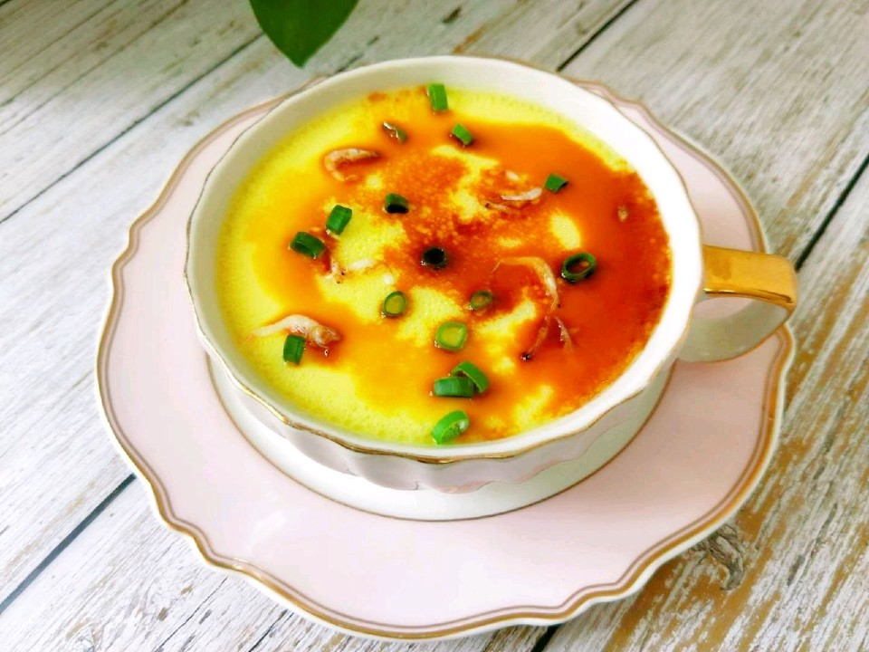

# 鸡蛋羹 超详细

## 📋 基本資訊 / Recipe Overview
- **料理名稱**：鸡蛋羹 超详细
- **原始標題**：鸡蛋羹（超详细）
- **素食流派 / Diet**：蛋素 Ovo-Vegetarian
- **料理分類 / Category**：湯品羹湯
- **難易度 / Difficulty**：配菜(中级)
- **烹飪時間 / Cooking Time**：10~30分钟
- **來源平台 / Source**：[豆果美食 · 素食專區](https://www.douguo.com/cookbook/2486182.html)

## 📝 料理故事與簡介 / Story & Introduction
> 如果想吃嫩嫩的鸡蛋羹，就不要有任何怀疑，一步一步按照菜谱做就可以啦

## 🌿 食材及佐料清單 / Ingredients
- 鸡蛋：2个
- 温水：270克
- 盐：1小勺
- 食用油：1勺
- 葱花：适量
- 海鲜酱油：1勺
- 醋：1勺

## 🍳 烹飪步驟 / Step-by-Step Cooking Steps
1. 新鲜鸡蛋2个，带壳55克左右，如果60克左右就再加上10克水，一个够大的碗，不要太大，合适就好，一碗温水量好，不烫手35-37℃
2. 鸡蛋打入一个稍微大点的碗里，因为一会儿要过筛，所以一共要用到两个碗
3. 打散之后，一边加入温水一边搅打鸡蛋
4. 搅好的状态，不要怀疑，就是很稀的
5. 加盐，加食用油搅打均匀，盐要加，不加盐就不成型了
6. 过滤2遍，滤网中的就不要了，不过滤会影响口感，过滤完吃到最后一口都是嫩滑的
7. 如果表面有泡沫就静止一会儿消泡，或者用一个小勺碰一下泡沫就消除了，然后盖保鲜膜
8. 水开后上蒸锅大火蒸10分钟，蒸好撒点香葱花
9. 看看这嫩嫩的样子，不然就蒸一次试试吧
10. 淋上一勺海鲜酱油一勺醋，一捏海米，开吃吧

---
*食譜歸檔時間：2026-08-20 · 來源：豆果美食 (www.douguo.com)*