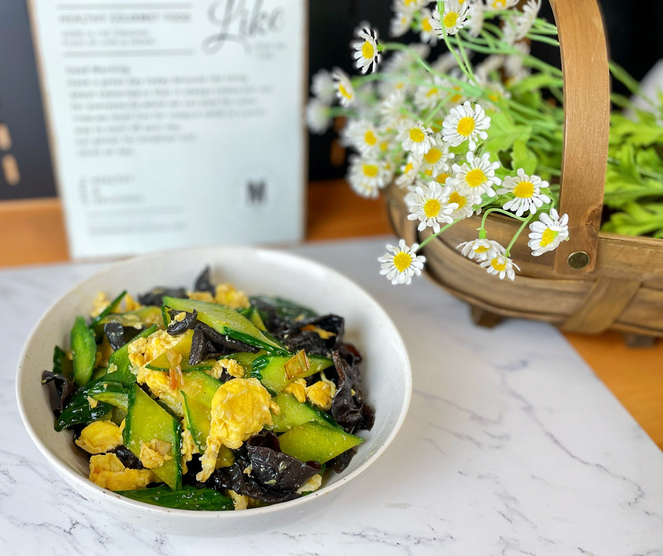

# 黄瓜木耳炒蛋

## 📋 基本資訊 / Recipe Overview
- **料理名稱**：黄瓜木耳炒蛋
- **原始標題**：黄瓜木耳炒蛋
- **素食流派 / Diet**：蛋素 Ovo-Vegetarian
- **料理分類 / Category**：家常蔬食 / 經典熱菜
- **來源平台 / Source**：[豆果美食 · 素食專區](https://www.douguo.com/cookbook/3157527.html)

## 🌿 食材及佐料清單 / Ingredients
- 鸡蛋 2个
- 黄瓜 1根
- 盐 3克
- 泡发黑木耳 80克
- 味达美生抽 1勺
- 味达美料酒 1勺

## 🍳 烹飪步驟 / Step-by-Step Cooking Steps
1. 木耳泡发，切条
2. 黄瓜切菱形块
3. 鸡蛋打散，炒熟盛出
4. 锅中倒油爆香葱花，下木耳黄瓜翻炒。
5. 料酒从锅边淋入炝锅。再倒入一勺味达美生抽调味
6. 加入炒散的鸡蛋。
7. 翻炒均匀。加入盐，芝麻油出锅。
8. 装盘

## 💡 大廚美味秘訣 / Chef's Tips
- 木耳黄瓜都是可以生吃的，稍微翻炒就好

---
*食譜歸檔時間：2026-08-21 · 來源：豆果美食 (www.douguo.com)*