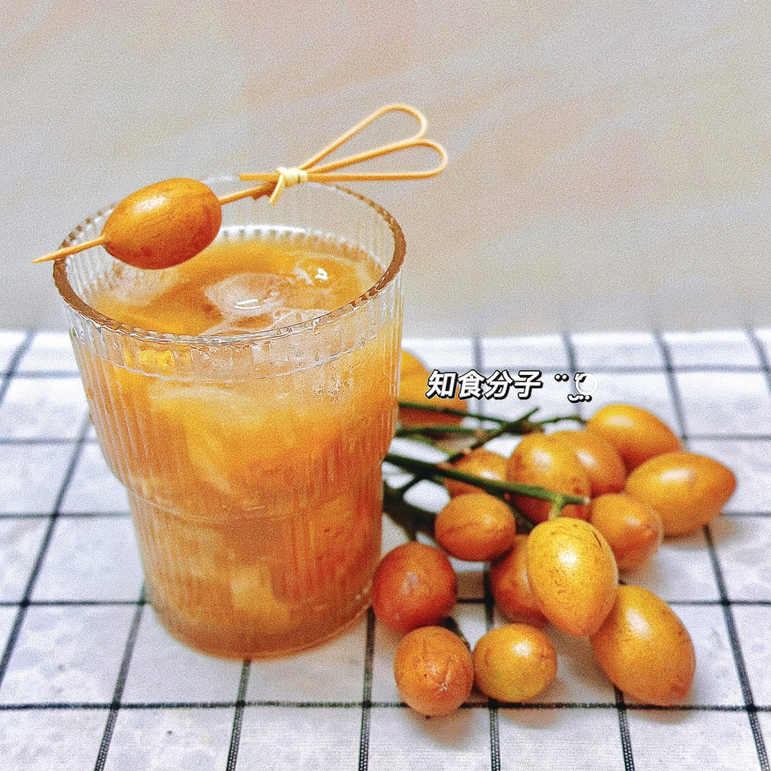

# 黄皮红茶饮

## 📋 基本資訊 / Recipe Overview
- **料理名稱**：黄皮红茶饮
- **原始標題**：黄皮红茶饮
- **素食流派 / Diet**：全素 Vegan
- **料理分類 / Category**：養生飲品 / 甜湯
- **來源平台 / Source**：[豆果美食 · 素食專區](https://www.douguo.com/cookbook/3335493.html)

## 🌿 食材及佐料清單 / Ingredients
- 黄皮 16粒
- 红茶 10克
- 热水 150ml
- 糖浆 2勺
- 盐 2匙

## 🍳 烹飪步驟 / Step-by-Step Cooking Steps
1. 准备黄皮和红茶。
2. 泡上红茶备用。
3. 放入2匙盐和清水把黄皮搓洗干净。
4. 记得多投洗几次洗干净。
5. 黄皮去核备用。
6. 把黄皮和糖浆倒入，用棒子挤压黄皮，然后倒入红茶摇匀即可。
7. 串一个黄皮摆饰，把摇匀的黄皮红茶倒入杯子，放入冰块，这样一杯酸甜清爽的黄皮红茶饮就做好了。

---
*食譜歸檔時間：2026-08-21 · 來源：豆果美食 (www.douguo.com)*