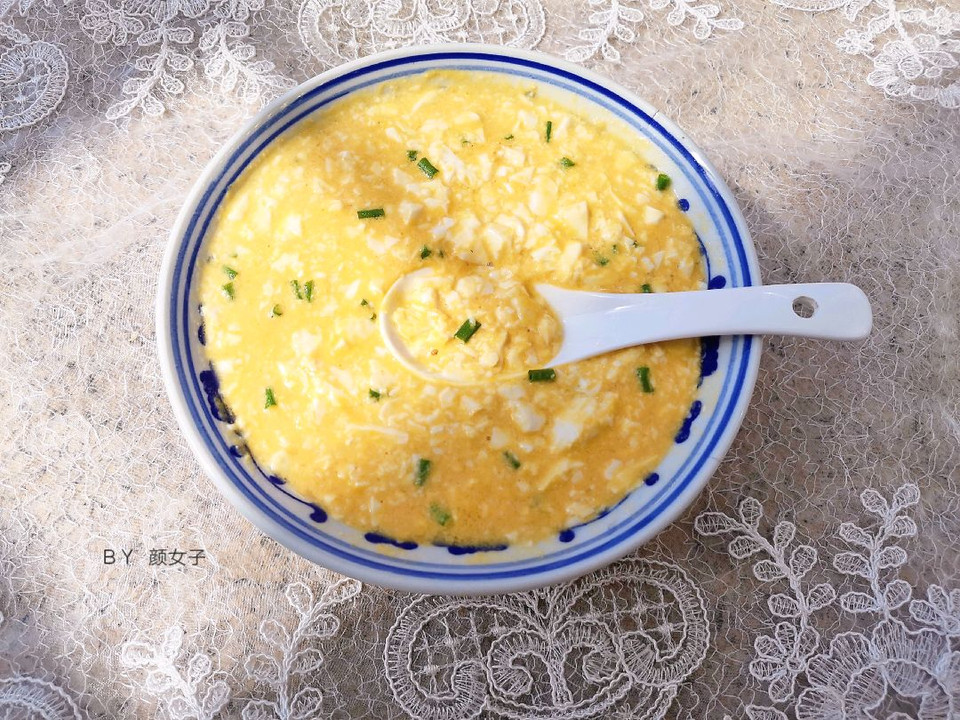

# 黄金豆腐羹

## 📋 基本資訊 / Recipe Overview
- **料理名稱**：黄金豆腐羹
- **原始標題**：黄金豆腐羹
- **素食流派 / Diet**：蛋素 Ovo-Vegetarian
- **料理分類 / Category**：湯品羹湯
- **難易度 / Difficulty**：切墩(初级)
- **烹飪時間 / Cooking Time**：10-30分钟
- **來源平台 / Source**：[豆果美食 · 素食專區](https://www.douguo.com/cookbook/2352037.html)

## 📝 料理故事與簡介 / Story & Introduction
> 谢谢你这么可爱ớ ₃ờ还喜欢我，我是颜女子坚持做早餐三年，用心做每一道美食，用早餐拉开一天完美的序幕，做踏实的食物，过踏实的日子，有时候生活中的仪式感，就是一场摆拍，今天分享一款黄金豆腐羹你们今天吃的什么呢？

## 🌿 食材及佐料清單 / Ingredients
- 咸鸭蛋(取蛋黄)：4个
- 内酯豆腐：一盒
- 葱：适量
- 油：适量
- 盐：适量

## 🍳 烹飪步驟 / Step-by-Step Cooking Steps
1. 准备好食材
2. 葱切断，咸鸭蛋黄压成泥
3. 美食锅倒入油，炒蛋黄
4. 加入水烧开
5. 内酯豆腐弄碎倒进锅中
6. 煮开
7. 加入适量盐和葱花起锅
8. 一碗又香又嫩的黄金豆腐羹就做好啦
9. 开启用餐吧

---
*食譜歸檔時間：2026-08-20 · 來源：豆果美食 (www.douguo.com)*