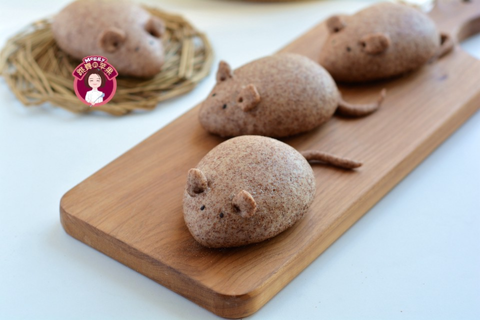

# 黑全麦老鼠馒头

## 📋 基本資訊 / Recipe Overview
- **料理名稱**：黑全麦老鼠馒头
- **原始標題**：黑全麦老鼠馒头
- **素食流派 / Diet**：全素 Vegan
- **料理分類 / Category**：烘焙麵點 / 點心
- **難易度 / Difficulty**：切墩(初级)
- **烹飪時間 / Cooking Time**：30-60分钟
- **來源平台 / Source**：[豆果美食 · 素食專區](https://www.douguo.com/cookbook/2396658.html)

## 📝 料理故事與簡介 / Story & Introduction
> 今年是鼠年，很多人都做了小老鼠的馒头或者豆包，我也没闲着，趁着春节假期这么长，我也做个手工解解闷儿吧。 
春节宅在家不能外出，大人可以有各种娱乐活动如看书、听电视等来打发时间，而小孩子就要家长来陪伴。不如带着孩子做这个小老鼠馒头，不错的亲子手工活动，孩子也哄了，饭也做好了，全不耽误。

## 🌿 食材及佐料清單 / Ingredients
- 黑全麦粉：200克
- 低筋面粉：200克
- 干酵母：4克
- 白糖：10克
- 水：240克

## 🍳 烹飪步驟 / Step-by-Step Cooking Steps
1. 材料准备好：黑全麦粉，低筋面粉或者中筋面粉，干酵母、白糖、室温下的清水；没有黑全麦粉可用其它杂粮代替，或者全部用中筋面粉；
2. 全部材料入长帝厨师机揉面桶中，用低速1档将材料混合均匀；想要塑形好而不变形，水不能太多，根据面粉的吸水率来调整，一般水量是粉量的55-60%，经过发酵后硬面团还会变软；
3. 面团收圆放在深盆里，蒙保鲜膜放在温暖湿润处进行基础发酵；我放在了发酵箱里，温度30，湿度65，时间暂定1.5小时，看面团状态来调整；
4. 面团是原来的2倍大时，手指蘸面粉在面团顶部戳个洞，不塌陷不回缩，发酵成功；
5. 扒开面团，可以看到面团内部充满了均匀细致的气孔；
6. 将面团倒在案板上，撒一把黑全麦粉，稍用力揉100下，使面团重新恢复成发酵前的状态；称重分成9份，其中一份用来做老鼠耳朵和尾巴，面团可以小一些；其它8个面团的重量约在75克/个；
7. 不用松弛，直接将面团搓成水滴状；搓得细长且高一些，最后的成品立体感会更强，我搓得不太长，所以最后的小老鼠就有点儿肥了；8个面团一气呵成搓成小老鼠身子，摆放在铺了蒸垫的蒸盘里；
8. 剩下的小面团搓成细长条，切16个小剂子，用手指肚按扁成老鼠耳朵；
9. 用筷子尖头将耳朵按压进面团尖端靠前位置；
10. 剩下的面团搓成一头粗一头细的小尾巴；
11. 用筷子尖头将尾巴装上；老鼠的眼睛就用黑芝麻蘸少许凉水安在头部位置；如果想要老鼠的眼睛更有灵气，可以用绿豆、花椒籽等来装饰，只是考虑到食用时还要抠下来，还是用黑芝麻更方便；
12. 老鼠馒头生坯放在温暖湿润处二次发酵，可以放在发酵箱中，温度33度，湿度65；或者放在烤箱中，再放一碗热水；待老鼠馒头生坯是原来的1.5倍大小时，用“蒸”功能，110度，20分钟，蒸熟后焖5分钟再出箱；用蒸锅要冷水入锅，大火上汽后蒸15-20分钟，焖5分钟再出锅，可防止表皮因骤冷而收缩发皱。

## 💡 大廚美味秘訣 / Chef's Tips
- 1. 没有黑全麦粉可以用其它粉类来代替，为了塑形好，水量不要太多，是粉量的55-60%为宜，且最后发酵也无需到2倍大，1.5倍就可以开蒸了； 
2. 这个小老鼠是花式馒头，也可以包裹豆沙馅或者其它馅料成花式包子； 
3. 数量可多可少，用面剂子大小来调整； 
4. 小老鼠的眼睛和胡子，还可以用融化的巧克力来做装饰。

---
*食譜歸檔時間：2026-08-20 · 來源：豆果美食 (www.douguo.com)*