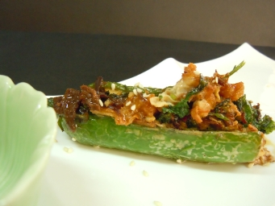

# 一葦渡江

## 📋 基本資訊 / Recipe Overview
- **料理名稱**：一葦渡江
- **份量 / Servings**：2-4 人份
- **素食流派 / Diet**：全素 Vegan (佛教純素)
- **料理分類 / Category**：养生汤品
- **來源平台 / Source**：[香港佛教聯合會 · 素食食譜](https://www.hkbuddhist.org/zh/top_page.php?p=medical_menu_detail&cid=7&type_id=2&mmid=52&id=29)
- **刊物出處**：資料來源：《香港佛教》月刊

## 🌿 食材清單 / Ingredients
- (12人分量) : 長尖青椒12隻，鮮腐竹3張
- 冬菇10隻
- 雜豆1湯匙
- 羊肚菌12朵
- 薑茸。

## 🍳 烹飪步驟 / Step-by-Step Cooking Steps
1. 長尖青椒洗淨，切開邊備用。
2. 鮮腐竹加少量薑茸及油用水蒸半小時，直至腐竹成茸狀態。
3. 冬菇切成細粒狀加入雜豆用攪拌器打勻至茸狀，取出後以適量調味及薑爆香備用。
4. 將腐竹茸和已爆香之冬菇茸拌勻，然後釀入長尖青椒內，放入油鍋內炸約２分鐘。
5. 羊肚菌洗淨，調好味及加入少許冰糖炆半小時，埋芡汁。
6. 上碟時，將羊肚菌和芡汁淋上面即成。

---
*食譜歸檔時間：2026-08-20 · 來源：香港佛教聯合會 (www.hkbuddhist.org)*