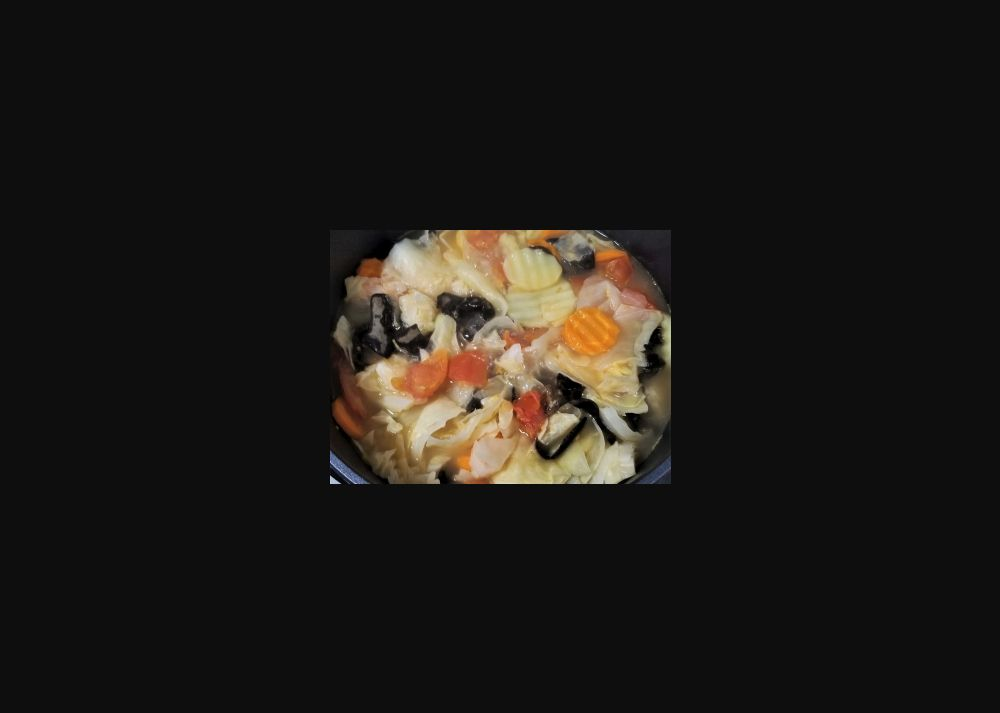

# 亂燉

## 📋 基本資訊 / Recipe Overview
- **料理名稱**：亂燉
- **份量 / Servings**：2-4 人份
- **素食流派 / Diet**：全素 Vegan (佛教純素)
- **料理分類 / Category**：养生汤品 / 家常燉菜
- **來源平台 / Source**：[香港佛教聯合會 · 素食食譜](https://www.hkbuddhist.org/zh/top_page.php?p=medical_menu_detail&cid=7&type_id=2&mmid=88&id=29)
- **刊物出處**：資料來源：《佛聯匯訊》
- **功德鳴謝**：鳴謝：溫綺玲居士
- **食譜介紹**：家中大老爺之前很饞嘴，喜歡四處找尋美食，至今仍對位於跑馬地一家已結業的韓國菜館的「亂燉」，念念不忘。該店菜單中沒有「亂燉」，一次老闆娘知道我們的口味，特別為我們煮這道菜。她還細心烘焙幾片油鹽紫菜，讓我們捲包熱騰騰、又黏又糯的韓國米飯來吃，美味又健康！

## 🌿 食材清單 / Ingredients
- 捲心菜 約200克
- 小甘筍 1條
- 馬鈴薯 1個
- 雲耳 40克
- 小番茄 2個
- 冬菇 數朵（可按喜好選用）
- 榨菜 少許（可按喜好選用）
- 薑 3片
- 油 少許
- 水 4杯

## 🧂 調味料 / Seasonings
- 鹽 適量

## 🍳 烹飪步驟 / Step-by-Step Cooking Steps
1. 浸軟冬菇；榨菜洗淨切絲；捲心菜、小甘筍、馬鈴薯、雲耳、小番茄洗淨切件。
2. 鍋中熱油，爆香薑片，略炒冬菇；加入捲心菜、小甘筍、馬鈴薯、雲耳、小番茄炒勻；再加水煲至腍；最後加調味料便成。

---
*食譜歸檔時間：2026-08-20 · 來源：香港佛教聯合會 (www.hkbuddhist.org)*
