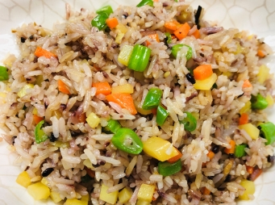

# 五彩冬菇時蔬炒飯

## 📋 基本資訊 / Recipe Overview
- **料理名稱**：五彩冬菇時蔬炒飯
- **份量 / Servings**：2 人份
- **素食流派 / Diet**：全素 Vegan (佛教純素)
- **料理分類 / Category**：面食主食
- **來源平台 / Source**：[香港佛教聯合會 · 素食食譜](https://www.hkbuddhist.org/zh/top_page.php?p=medical_menu_detail&cid=7&type_id=2&mmid=74&id=29)
- **刊物出處**：資料來源：《香港佛教》月刊
- **功德鳴謝**：鳴謝：朱丹鳳女士

## 🌿 食材清單 / Ingredients
- 白米 100克
- 糙米 少許
- 冬菇 3朵
- 馬鈴薯 半個
- 紅蘿蔔 1根
- 四季豆 50克

## 🧂 調味料 / Seasonings
- 香菇粉 2茶匙
- 鹽 1茶匙
- 豉油 1湯匙
- 芥花籽油 30毫升
- 麻油 1茶匙

## 🍳 烹飪步驟 / Step-by-Step Cooking Steps
1. 洗米煮飯，飯熟後盛起待涼，再放進冰箱內。
2. 泡發冬菇，然後切丁。
3. 馬鈴薯及紅蘿蔔削皮，洗淨切丁；四季豆洗淨，撕去筋部，切丁。
4. 把芥花籽油倒入鑊中，油溫升至8成熱，將所有材料倒進鑊後炒1分鐘；再放入已冰過的飯拌炒，最後加進調味料，拌炒1分鐘，即可上碟。

---
*食譜歸檔時間：2026-08-20 · 來源：香港佛教聯合會 (www.hkbuddhist.org)*