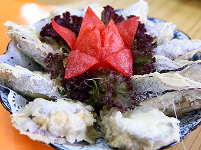

# 伽酡香酥 釀茄子

## 📋 基本資訊 / Recipe Overview
- **料理名稱**：伽酡香酥 釀茄子
- **份量 / Servings**：2-4 人份
- **素食流派 / Diet**：全素 Vegan (佛教純素)
- **料理分類 / Category**：面点小吃
- **來源平台 / Source**：[香港佛教聯合會 · 素食食譜](https://www.hkbuddhist.org/zh/top_page.php?p=medical_menu_detail&cid=7&type_id=2&mmid=10&id=29)
- **刊物出處**：資料來源：《香港佛教》月刊

## 🌿 食材清單 / Ingredients
- 茄瓜
- 冬菇粒
- 鮮腐竹
- 豆腐
- 炸菜
- 芝麻
- 九層塔葉

## 🍳 烹飪步驟 / Step-by-Step Cooking Steps
1. 先把茄瓜洗淨抹乾，斜切成片，每片約1cm厚度待用；
2. 把冬菇切粒，鮮腐竹、豆腐切碎，炸菜切粒，加入少許鹽、糖、豉油、麻油略炒備用；
3. 把茄子片撲上生粉，把炒好饀料釀入茄子片；
4. 炸漿粉加入生油、清水開成炸漿，把釀好的茄子沾上炸漿；
5. 油以中火燒熱，把釀好及沾上炸漿的茄子過油炸，炸至差不多金黄色後，轉至大火炸至金黄色後地窩上碟（轉至大火炸至金黄色後才地窩，可把食物內 的油迫出，不至油膩，使油炸食品更為香口而不至油膩）；
6. 上碟後可加少許芝麻及幾片九層塔葉即成。

---
*食譜歸檔時間：2026-08-20 · 來源：香港佛教聯合會 (www.hkbuddhist.org)*