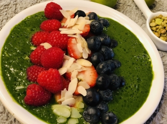

# 健康輕盈蔬果露

## 📋 基本資訊 / Recipe Overview
- **料理名稱**：健康輕盈蔬果露
- **份量 / Servings**：2 人份
- **素食流派 / Diet**：全素 Vegan (佛教純素)
- **料理分類 / Category**：养生汤品
- **來源平台 / Source**：[香港佛教聯合會 · 素食食譜](https://www.hkbuddhist.org/zh/top_page.php?p=medical_menu_detail&cid=7&type_id=2&mmid=80&id=29)
- **刊物出處**：資料來源：《香港佛教》月刊
- **功德鳴謝**：鳴謝：朱丹鳳女士

## 🌿 食材清單 / Ingredients
- 香蕉 2根
- 紅桑子 1盒
- 草莓 1盒
- 藍莓 1盒
- 檸檬 個
- 杏仁片（或綠茶味麥片） 10克
- 椰漿 2湯匙
- 有機菠菜 100克

## 🍳 烹飪步驟 / Step-by-Step Cooking Steps
1. 除香蕉外，清洗所有蔬果，滴乾備用。
2. 香蕉切塊，菠菜葉切碎，再放入攪拌機內；榨檸檬汁，加椰漿，攪拌成蔬果露；倒入碗中，再放上紅桑子、草莓、藍莓、杏仁片即可食用。

---
*食譜歸檔時間：2026-08-20 · 來源：香港佛教聯合會 (www.hkbuddhist.org)*