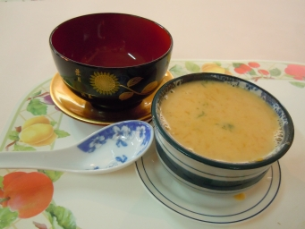

# 南國飄香

## 📋 基本資訊 / Recipe Overview
- **料理名稱**：南國飄香
- **份量 / Servings**：2-4 人份
- **素食流派 / Diet**：奶素 Lacto-Vegetarian
- **料理分類 / Category**：佛門素齋 / 養生佳餚
- **來源平台 / Source**：[香港佛教聯合會 · 素食食譜](https://www.hkbuddhist.org/zh/top_page.php?p=medical_menu_detail&cid=7&type_id=2&mmid=47&id=29)
- **刊物出處**：資料來源：《香港佛教》月刊

## 🌿 食材清單 / Ingredients
- 南瓜一個約一斤重
- 蘑菇忌廉湯一罐
- 鮮忌廉一小盒
- 一湯匙薑茸

## 🧂 調味料 / Seasonings
- 鹽及黑胡椒粉

## 🍳 烹飪步驟 / Step-by-Step Cooking Steps
1. 先將南瓜洗淨，去皮切細片，加入薑茸一起蒸約二十分鐘，直至焾身，之後壓成茸備用。
2. 將蘑菇忌廉湯開稀成湯狀後，將南瓜茸倒入，加少量鹽及黑胡椒粉作調味，加熱至滾起，最後加入鮮忌廉攪勻，令湯變得更香更滑。

---
*食譜歸檔時間：2026-08-20 · 來源：香港佛教聯合會 (www.hkbuddhist.org)*