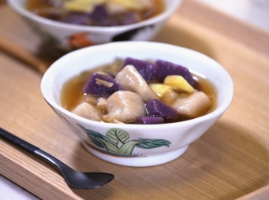

# 台式黑糖薑茶雙色芋圓

## 📋 基本資訊 / Recipe Overview
- **料理名稱**：台式黑糖薑茶雙色芋圓
- **份量 / Servings**：4至5人份
- **素食流派 / Diet**：全素 Vegan (佛教純素)
- **料理分類 / Category**：面食主食
- **來源平台 / Source**：[香港佛教聯合會 · 素食食譜](https://www.hkbuddhist.org/zh/top_page.php?p=medical_menu_detail&cid=7&type_id=2&mmid=68&id=29)
- **刊物出處**：資料來源：《香港佛教》月刊
- **功德鳴謝**：鳴謝：鄺梓罡 佛門網 素食餐廳「雅．悠蔬食」

## 🌿 食材清單 / Ingredients
- 芋頭300克
- 紫心蕃薯300克
- 木薯粉100克x 2
- 砂糖40克x 2
- 生粉適量
- 熱水適量
- 黑糖25克
- 生薑茶50克
- 薑片適量
- 熱水600克

## 🍳 烹飪步驟 / Step-by-Step Cooking Steps
1. 芋頭和紫心蕃薯蒸熟後，保持熱的狀態備用。
2. 將100克木薯粉和40克砂糖放在器皿內拌匀，用作搓芋圓麵糰。
3. 放紫心蕃薯進器皿內，以壓薯蓉工具將紫心蕃薯、木薯粉和砂糖拌勻。待麵糰稍冷後，拿出來用手搓糰，期間加適量生粉以免黏手。如麵糰質地偏軟，可再加適量木薯粉。如偏硬可加入少許水。最後將麵糰搓成長條狀，切粒備用。
4. 芋頭跟紫心蕃薯做法相同。
5. 燒熱一鍋水，水滾後將芋頭和紫心蕃薯芋圓放進內烚熟，撈起浸冰水備用。
6. 燒熱鍋，放薑片爆香後，再加約600克熱水、50克生薑茶及25克黑糖進內，略煮一會即完成。
7. 最後將芋圓放進黑糖薑茶內，煮至芋圓浮起即可上碟，趁熱享用。
8. 如家中有廚師機，可直接將蒸熟的芋頭和紫心蕃薯，分別連同木薯粉和砂糖加進機內打成麵糰。
9. 將烚熟的芋圓浸冰水，這步驟能令芋圓吃進口更彈牙。
10. 黑糖薑茶的水和糖比例約為8比1，建議先跟這個比例製作，如試味時嫌太甜，可加熱水；如不夠甜則加黑糖。

---
*食譜歸檔時間：2026-08-20 · 來源：香港佛教聯合會 (www.hkbuddhist.org)*