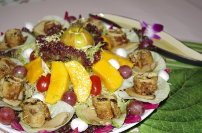

# 地久天長

## 📋 基本資訊 / Recipe Overview
- **料理名稱**：地久天長
- **份量 / Servings**：2-4 人份
- **素食流派 / Diet**：全素 Vegan (佛教純素)
- **料理分類 / Category**：养生汤品
- **來源平台 / Source**：[香港佛教聯合會 · 素食食譜](https://www.hkbuddhist.org/zh/top_page.php?p=medical_menu_detail&cid=7&type_id=2&mmid=46&id=29)
- **刊物出處**：資料來源：《香港佛教》月刊

## 🌿 食材清單 / Ingredients
- 腐皮4塊
- 白靈菇一個
- 意大利生菜
- 苜蓿芽
- 生果(蘋果
- 芒果
- 提子
- 車厘茄)
- 西生菜素片
- 汁料: 陳皮一個
- 乾草菇2両
- 鹵水汁約一杯
- 生抽
- 老抽
- 糖
- 盬適量

## 🍳 烹飪步驟 / Step-by-Step Cooking Steps
1. 意大利生菜、苜蓿芽放在大圓碟中央，放上生果((蘋果、芒果、提子、車厘茄)用作裝飾，西生菜切片放在碟最外邊。
2. 素鴨:先將陳皮和乾草菇切碎，用生抽、老抽、糖、盬適量作調味，加入鹵水汁煮約10分鐘備用。腐皮攤開，將已煮好的汁用湯匙放一匙在腐皮中央處，再加一塊腐皮上面捲好，等約一小時(讓腐皮充分吸收到汁的味道)。
3. 白靈菇切片用中火油炸至金黃色。
4. 將素鴨放入油鑊，兩面中火炸至金黃色，撈起即切段，連同白靈菇放在大圓碟之西生菜片上即成。

---
*食譜歸檔時間：2026-08-20 · 來源：香港佛教聯合會 (www.hkbuddhist.org)*