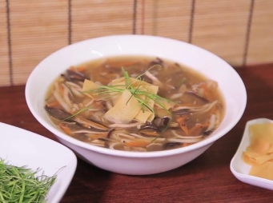

# 太史五菇羹

## 📋 基本資訊 / Recipe Overview
- **料理名稱**：太史五菇羹
- **份量 / Servings**：4人份
- **素食流派 / Diet**：全素 Vegan (佛教純素)
- **料理分類 / Category**：养生汤品
- **來源平台 / Source**：[香港佛教聯合會 · 素食食譜](https://www.hkbuddhist.org/zh/top_page.php?p=medical_menu_detail&cid=7&type_id=2&mmid=66&id=29)
- **刊物出處**：資料來源：《香港佛教》月刊
- **功德鳴謝**：鳴謝：鄺梓罡 佛門網 佛教慈濟基金會香港分會

## 🌿 食材清單 / Ingredients
- 陳皮末1小片
- 白背木耳絲2片
- 素火腿絲適量
- 炸薑絲2湯匙
- 甘筍絲適量
- 冬菇絲2隻
- 雞脾菇絲1條
- 白菌絲4粒
- 炸金菇半包
- 薄脆片（後加）適量
- 檸檬葉絲（後加）3片

## 🧂 調味料 / Seasonings
- 素蠔油1.5湯匙
- 老抽1茶匙
- 鹽1/2茶匙
- 香菇粉1茶匙
- 糖1茶匙
- 胡椒粉適量
- 馬蹄粉水適量

## 🍳 烹飪步驟 / Step-by-Step Cooking Steps
1. 金菇切絲，以油炸至金黃色後，加入薑絲再略炸一會，撈起瀝油備用。
2. 熱鍋下油，將冬菇絲、雞脾菇絲用大火炒至微金黃後，加入木耳絲及甘筍絲略炒香後，加入適量的熱水。
3. 然後加入白菌絲、素火腿絲、炸薑絲及炸金菇絲，煮至沸騰，撈去泡沫。
4. 略煮3至5分鐘後，再加入所有調味料（除馬蹄粉水）拌匀，最後加入陳皮末及馬蹄粉水煮至濃稠。
5. 倒入容器中，放上檸檬葉絲及薄脆伴食，完成。
6. 鄺梓罡（Ken Kwong）簡介：
7. 現職「悠蔬食」及「雅．悠蔬食」餐廳主廚，自小醉心廚藝，喜歡鑽研多國料理，曾遠赴台灣學習素食料理，發願要將傳統素菜改頭換面，集多國料理所長，煮出色香味營的菜式。Ken現與佛門網Channel B體驗頻道合作《素食教煮》節目，示範不同風格的素菜，讓大眾能對素食改觀，藉此推廣素食，為保護地球出一分力。

---
*食譜歸檔時間：2026-08-20 · 來源：香港佛教聯合會 (www.hkbuddhist.org)*