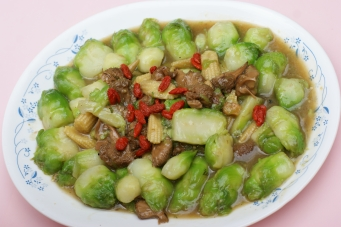

# 奕葉流芳

## 📋 基本資訊 / Recipe Overview
- **料理名稱**：奕葉流芳
- **份量 / Servings**：2-4 人份
- **素食流派 / Diet**：全素 Vegan (佛教純素)
- **料理分類 / Category**：养生汤品
- **來源平台 / Source**：[香港佛教聯合會 · 素食食譜](https://www.hkbuddhist.org/zh/top_page.php?p=medical_menu_detail&cid=7&type_id=2&mmid=42&id=29)
- **刊物出處**：資料來源：《香港佛教》月刊

## 🌿 食材清單 / Ingredients
- 兒菜或小椰菜1斤
- 珍珠筍10條
- 猴頭菇3顆
- 杞子少許
- 醬汁：豉油
- 麻油
- 鹽
- 糖
- 開水適量

## 🍳 烹飪步驟 / Step-by-Step Cooking Steps
1. 先將兒菜或小椰菜開邊洗淨，放入熱開水(加薑2片、鹽) 氽水後備用；
2. 珍珠筍、猴頭菇浸泡後切成小粒；
3. 豉油、麻油、鹽、糖、開水適量入鍋煮沸，把兒菜、珍珠筍、猴頭菇放入醬汁快炒至熟透，最後放入杞子略炒即成。

---
*食譜歸檔時間：2026-08-20 · 來源：香港佛教聯合會 (www.hkbuddhist.org)*