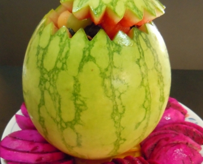

# 始覺妙覺

## 📋 基本資訊 / Recipe Overview
- **料理名稱**：始覺妙覺
- **份量 / Servings**：2-4 人份
- **素食流派 / Diet**：全素 Vegan (佛教純素)
- **料理分類 / Category**：佛門素齋 / 養生佳餚
- **來源平台 / Source**：[香港佛教聯合會 · 素食食譜](https://www.hkbuddhist.org/zh/top_page.php?p=medical_menu_detail&cid=7&type_id=2&mmid=51&id=29)
- **刊物出處**：資料來源：《香港佛教》月刊

## 🌿 食材清單 / Ingredients
- 西瓜一個
- 藍莓約30粒
- 蜜瓜10粒
- 哈蜜瓜10粒
- 青提子10粒
- 紅提子10粒
- 紅肉火龍果4個。

## 🍳 烹飪步驟 / Step-by-Step Cooking Steps
1. 西瓜切開，保留切開的部分作蓋子用，兩者均用刀切花邊。
2. 用圓形的匙羹將西瓜肉挖空，成一個個的西瓜圓球。其它的蜜瓜與哈蜜瓜亦以同樣方法製成圓球。
3. 紅肉火龍果去皮切片。
4. 將所有材料：西瓜圓球、蜜瓜圓球、哈蜜瓜圓球、藍莓、青提子、紅提子全部放到西瓜內即成，紅肉火龍果片作伴碟裝飾。最後亦可將蓋子放上，便成為一個多采多姿的西瓜盅。

---
*食譜歸檔時間：2026-08-20 · 來源：香港佛教聯合會 (www.hkbuddhist.org)*