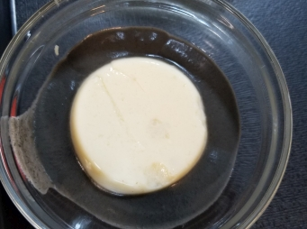

# 寒天豆腐

## 📋 基本資訊 / Recipe Overview
- **料理名稱**：寒天豆腐
- **份量 / Servings**：2-4 人份
- **素食流派 / Diet**：全素 Vegan (佛教純素)
- **料理分類 / Category**：面食主食
- **來源平台 / Source**：[香港佛教聯合會 · 素食食譜](https://www.hkbuddhist.org/zh/top_page.php?p=medical_menu_detail&cid=7&type_id=2&mmid=84&id=29)
- **刊物出處**：資料來源：《佛聯匯訊》
- **功德鳴謝**：鳴謝：溫綺玲居士

## 🌿 食材清單 / Ingredients
- 寒天粉 1包（25克）
- 有機黃豆 1杯
- 水 1公升

## 🍳 烹飪步驟 / Step-by-Step Cooking Steps
1. 洗淨有機黃豆，以清水浸泡2小時後，撈起黃豆備用。
2. 將水和黃豆倒進攪拌機內，攪成豆漿，隔渣取濃汁。如果喜歡吃甜，可以隨意加入少許羅漢果糖或冰糖一起攪拌。
3. 把寒天粉倒進80度熱的豆漿內，邊倒邊攪勻；再隔渣，待涼後放進冰箱。若用芝麻糊伴食，絕配。

---
*食譜歸檔時間：2026-08-20 · 來源：香港佛教聯合會 (www.hkbuddhist.org)*