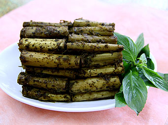

# 尋回古早味

## 📋 基本資訊 / Recipe Overview
- **料理名稱**：尋回古早味
- **份量 / Servings**：2-4 人份
- **素食流派 / Diet**：全素 Vegan (佛教純素)
- **料理分類 / Category**：养生汤品
- **來源平台 / Source**：[香港佛教聯合會 · 素食食譜](https://www.hkbuddhist.org/zh/top_page.php?p=medical_menu_detail&cid=7&type_id=2&mmid=14&id=29)
- **刊物出處**：資料來源：《香港佛教》月刊

## 🌿 食材清單 / Ingredients
- 老莧菜
- 香椿
- 沙茶醬
- 糖
- 華鹽
- 豉油適量

## 🍳 烹飪步驟 / Step-by-Step Cooking Steps
1. 老莧菜莖切段，飛水略過油；
2. 炆沙茶醬，下糖、華鹽、豉油少許；
3. 最後加香椿即可。
4. 註：此餸是寧波名菜，可去濕，又健康，配粥飯皆可。

---
*食譜歸檔時間：2026-08-20 · 來源：香港佛教聯合會 (www.hkbuddhist.org)*