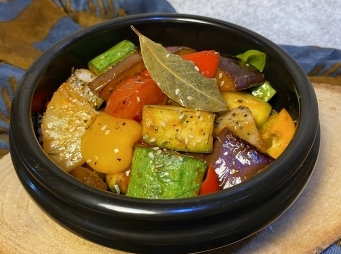

# 彩虹佛陀碗

## 📋 基本資訊 / Recipe Overview
- **料理名稱**：彩虹佛陀碗
- **份量 / Servings**：2人份
- **素食流派 / Diet**：全素 Vegan (佛教純素)
- **料理分類 / Category**：面食主食
- **來源平台 / Source**：[香港佛教聯合會 · 素食食譜](https://www.hkbuddhist.org/zh/top_page.php?p=medical_menu_detail&cid=7&type_id=2&mmid=106&id=29)
- **刊物出處**：資料來源：《香港佛教》月刊
- **功德鳴謝**：鳴謝：朱丹鳳女士

## 🌿 食材清單 / Ingredients
- 翠玉瓜 1根
- 茄子 1根
- 有機三色甜椒 1包
- 番茄 1個
- 火龍果 1/2個
- 罐裝菠蘿 1/2罐
- 熟白芝麻 少量（可隨個人喜好選用）

## 🧂 調味料 / Seasonings
- 義式綜合香料粉 1匙（可在街市或超市購買）
- 番茄醬 1湯匙
- 椰糖 1湯匙
- 鹽 1茶匙
- 素菇粉 1/2茶匙
- 芥花籽油 1湯匙
- 研磨黑胡椒粒 適量
- 香菇素蠔油 1湯匙
- 乾月桂葉 2片（可隨個人喜好選用）

## 🍳 烹飪步驟 / Step-by-Step Cooking Steps
1. 將所有蔬果洗淨，切成粒狀備用。
2. 熱鑊，倒進芥花籽油，將乾月桂葉炒香；加入翠玉瓜、茄子，炒腍；再加入三色甜椒、番茄和所有調味料，拌勻；小火炆煮約10分鐘（炆煮時多翻拌數次免燒焦鑊底），熄火前加入火龍果、菠蘿拌勻。可撒熟白芝麻，即可上碟。

---
*食譜歸檔時間：2026-08-20 · 來源：香港佛教聯合會 (www.hkbuddhist.org)*