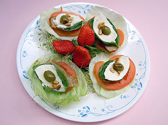

# 慧日醍醐

## 📋 基本資訊 / Recipe Overview
- **料理名稱**：慧日醍醐
- **份量 / Servings**：2-4 人份
- **素食流派 / Diet**：奶素 Lacto-Vegetarian
- **料理分類 / Category**：养生汤品
- **來源平台 / Source**：[香港佛教聯合會 · 素食食譜](https://www.hkbuddhist.org/zh/top_page.php?p=medical_menu_detail&cid=7&type_id=2&mmid=37&id=29)
- **刊物出處**：資料來源：《香港佛教》月刊

## 🌿 食材清單 / Ingredients
- 苜蓿芽
- 西生菜
- 蕃茄
- 素鴨
- 九層塔(香葉)或薄荷葉
- 水牛 奶芝士
- 罐頭橄欖粒
- 松子仁

## 🍳 烹飪步驟 / Step-by-Step Cooking Steps
1. 以上材料按需要切片或切粒，然後順序從底部先墊以少量苜蓿芽，再把西生菜、蕃茄、素鴨、九層塔、水牛奶芝士逐層向上鋪加，最後加上橄欖粒和松子仁即成。

---
*食譜歸檔時間：2026-08-20 · 來源：香港佛教聯合會 (www.hkbuddhist.org)*