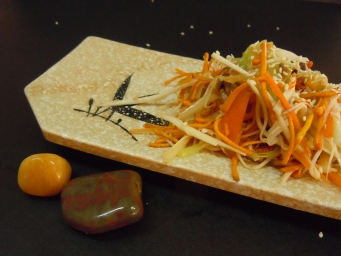

# 拈花微笑

## 📋 基本資訊 / Recipe Overview
- **料理名稱**：拈花微笑
- **份量 / Servings**：2-4 人份
- **素食流派 / Diet**：全素 Vegan (佛教純素)
- **料理分類 / Category**：佛門素齋 / 養生佳餚
- **來源平台 / Source**：[香港佛教聯合會 · 素食食譜](https://www.hkbuddhist.org/zh/top_page.php?p=medical_menu_detail&cid=7&type_id=2&mmid=50&id=29)
- **刊物出處**：資料來源：《香港佛教》月刊

## 🌿 食材清單 / Ingredients
- 新鮮淮山1小段
- 西洋甘筍半條
- 冬菇2-3朵
- 新鮮冬蟲草花2両
- 西芹兩塊。

## 🍳 烹飪步驟 / Step-by-Step Cooking Steps
1. 淮山、甘筍、西芹、冬菇切絲。淮山、甘筍用鹽醃一會，加少許糖。
2. 熱油鑊，下冬菇絲炒熟，備用。
3. 冬蟲草花、西芹用滾水拖一拖，加入少許冰糖。
4. 所有材料待涼後，加入少許椒鹽、麻油、生抽拌勻，再灑上芝麻裝飾即成。

---
*食譜歸檔時間：2026-08-20 · 來源：香港佛教聯合會 (www.hkbuddhist.org)*