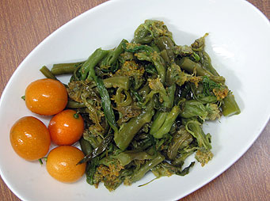

# 攻鼻辣菜

## 📋 基本資訊 / Recipe Overview
- **料理名稱**：攻鼻辣菜
- **份量 / Servings**：2-4 人份
- **素食流派 / Diet**：全素 Vegan (佛教純素)
- **料理分類 / Category**：佛門素齋 / 養生佳餚
- **來源平台 / Source**：[香港佛教聯合會 · 素食食譜](https://www.hkbuddhist.org/zh/top_page.php?p=medical_menu_detail&cid=7&type_id=2&mmid=9&id=29)
- **刊物出處**：資料來源：《香港佛教》月刊

## 🌿 食材清單 / Ingredients
- 辣菜

## 🍳 烹飪步驟 / Step-by-Step Cooking Steps
1. 把辣菜的菜心遠摘取出來，洗淨；
2. 煲滾開水(大滾)，下鹽，加少許葵花籽油；
3. 將辣菜放入滾水中，關火；
4. 立即連蓋將滾水倒清，按著蓋子把辣菜搖勻，放置枱上；
5. 1小時後，加少許麻油，放入瓶內；
6. 隔數小時後便可食用。
7. 該食品乃天然健康素食，無添加防腐劑；於弄好後，需放入雪櫃內儲存，否則容易變壞。

---
*食譜歸檔時間：2026-08-20 · 來源：香港佛教聯合會 (www.hkbuddhist.org)*