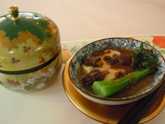

# 最上一乘

## 📋 基本資訊 / Recipe Overview
- **料理名稱**：最上一乘
- **份量 / Servings**：2-4 人份
- **素食流派 / Diet**：全素 Vegan (佛教純素)
- **料理分類 / Category**：佛門素齋 / 養生佳餚
- **來源平台 / Source**：[香港佛教聯合會 · 素食食譜](https://www.hkbuddhist.org/zh/top_page.php?p=medical_menu_detail&cid=7&type_id=2&mmid=49&id=29)
- **刊物出處**：資料來源：《香港佛教》月刊

## 🌿 食材清單 / Ingredients
- 蒸滑豆腐一盒
- 羊肚菌數塊
- 薑數片
- 菜心數株

## 🍳 烹飪步驟 / Step-by-Step Cooking Steps
1. 滑豆腐用容器裝好，（界刀）開數塊，用錫紙包好，隔水蒸約15分鐘，隔去多餘的水分。
2. 羊肚菌浸水及洗淨，用薑爆至微金黃色，加入水和冰糖炆半小時。
3. 羊肚菌加入生抽打芡淋上豆腐面即成。
4. 菜心煮熟後伴旁裝飾。

---
*食譜歸檔時間：2026-08-20 · 來源：香港佛教聯合會 (www.hkbuddhist.org)*