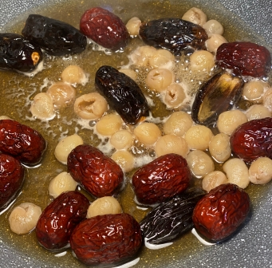

# 桂圓雙棗芋蓉

## 📋 基本資訊 / Recipe Overview
- **料理名稱**：桂圓雙棗芋蓉
- **份量 / Servings**：2 人份
- **素食流派 / Diet**：奶素 Lacto-Vegetarian
- **料理分類 / Category**：佛門素齋 / 養生佳餚
- **來源平台 / Source**：[香港佛教聯合會 · 素食食譜](https://www.hkbuddhist.org/zh/top_page.php?p=medical_menu_detail&cid=7&type_id=2&mmid=112&id=29)
- **刊物出處**：資料來源：《香港佛教》月刊
- **功德鳴謝**：鳴謝：朱丹鳳女士

## 🌿 食材清單 / Ingredients
- 芋頭 400克
- 桂圓 30克
- 椰棗 5顆
- 大紅棗 10顆
- 薑 3片
- 紅糖 30克
- 椰漿 40克
- 鮮奶油 80克
- 水 300毫升

## 🍳 烹飪步驟 / Step-by-Step Cooking Steps
1. 芋頭去皮切片，備用。
2. 在蒸鍋中燒開水，芋頭隔水蒸約15分鐘至熟透。
3. 一邊搗芋頭，一邊加入椰漿和鮮奶油，拌勻成芋蓉，備用。
4. 把桂圓、椰棗、紅棗、薑片、紅糖放入小鍋中，加水，以中小火收汁，煮至剩下1/4的湯。
5. 把芋蓉放進碗中，加入湯即可進食。

---
*食譜歸檔時間：2026-08-20 · 來源：香港佛教聯合會 (www.hkbuddhist.org)*