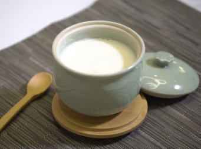

# 桃膠鮮百合杏仁茶

## 📋 基本資訊 / Recipe Overview
- **料理名稱**：桃膠鮮百合杏仁茶
- **份量 / Servings**：1人份
- **素食流派 / Diet**：全素 Vegan (佛教純素)
- **料理分類 / Category**：养生汤品
- **來源平台 / Source**：[香港佛教聯合會 · 素食食譜](https://www.hkbuddhist.org/zh/top_page.php?p=medical_menu_detail&cid=7&type_id=2&mmid=71&id=29)
- **刊物出處**：資料來源：《香港佛教》月刊
- **功德鳴謝**：鳴謝：鄺梓罡 佛門網 素食餐廳「雅．悠蔬食」

## 🌿 食材清單 / Ingredients
- 龍皇南杏130克
- 北杏50克
- 米15克
- 水1,200克
- 已浸軟桃膠80克
- 鮮百合（洗淨）60克
- 冰糖100克

## 🍳 烹飪步驟 / Step-by-Step Cooking Steps
1. 先將南北杏及米洗淨後，泡水至少2小時。
2. 再將南北杏及米隔去水分，然後略沖洗，瀝乾備用。
3. 將南北杏及米加入1,200克水，放入果汁機中，以高速攪拌3分鐘成杏仁漿。
4. 用豆漿袋將杏仁漿隔渣成杏汁。
5. 把冰糖、桃膠及鮮百合放進鍋中，最後倒進杏汁；用大火煮沸，再轉中小火將杏汁續煮至少8至10分鐘，其間需攪拌以免杏仁茶黏鍋底。完成，趁熱享用。

---
*食譜歸檔時間：2026-08-20 · 來源：香港佛教聯合會 (www.hkbuddhist.org)*