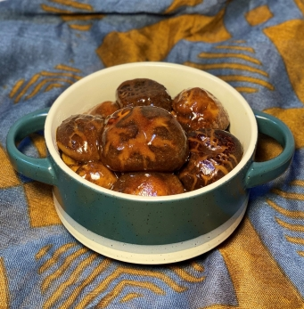

# 檸檬脯醬冬菇

## 📋 基本資訊 / Recipe Overview
- **料理名稱**：檸檬脯醬冬菇
- **份量 / Servings**：2人份
- **素食流派 / Diet**：全素 Vegan (佛教純素)
- **料理分類 / Category**：面食主食
- **來源平台 / Source**：[香港佛教聯合會 · 素食食譜](https://www.hkbuddhist.org/zh/top_page.php?p=medical_menu_detail&cid=7&type_id=2&mmid=105&id=29)
- **刊物出處**：資料來源：《香港佛教》月刊
- **功德鳴謝**：鳴謝：朱丹鳳女士

## 🌿 食材清單 / Ingredients
- 有機乾冬菇 100克
- 檸檬脯 1個
- 老薑 3片
- 乾辣椒 適量（可隨個人喜好選用）

## 🧂 調味料 / Seasonings
- 芥花籽油 1湯匙
- 麻油 1/2茶匙
- 香菇素蠔油 1湯匙
- 椰糖 1湯匙
- 醬油 1湯匙
- 素菇粉 1/2茶匙

## 🍳 烹飪步驟 / Step-by-Step Cooking Steps
1. 將冬菇洗淨，以水浸3個小時（水的分量不宜浸過冬菇面）；檸檬脯切粒，備用。
2. 熱鑊，倒進芥花籽油及麻油，再下冬菇炒香，撈起，備用。
3. 留下少許油於鑊內，放入乾辣椒略炒；加入檸檬脯粒、香菇素蠔油、椰糖、醬油、素菇粉炒勻，再倒入冬菇及一半的冬菇水。中火燜煮約40分鐘，汁煮至變稠，撈起上碟。

---
*食譜歸檔時間：2026-08-20 · 來源：香港佛教聯合會 (www.hkbuddhist.org)*