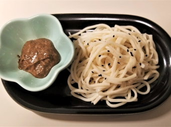

# 欖醬拌麵

## 📋 基本資訊 / Recipe Overview
- **料理名稱**：欖醬拌麵
- **份量 / Servings**：2-4 人份
- **素食流派 / Diet**：全素 Vegan (佛教純素)
- **料理分類 / Category**：面食主食
- **來源平台 / Source**：[香港佛教聯合會 · 素食食譜](https://www.hkbuddhist.org/zh/top_page.php?p=medical_menu_detail&cid=7&type_id=2&mmid=96&id=29)
- **刊物出處**：資料來源：《佛聯匯訊》
- **功德鳴謝**：鳴謝：溫綺玲居士

## 🌿 食材清單 / Ingredients
- 欖角 6-8粒
- 欖菜 約1湯匙
- 腰果或松子 20克
- 羅漢果糖或砂糖 1/2茶匙
- 橄欖油 約1/3杯
- 黑芝麻 少許
- 淮山麵或白麵條 適量

## 🧂 調味料 / Seasonings
- 鹽 少許
- 糖 少許

## 🍳 烹飪步驟 / Step-by-Step Cooking Steps
1. 以少許橄欖油、糖來蒸欖角10分鐘左右。
2. 把欖角、欖菜、腰果、糖、橄欖油加入攪拌機內，攪成幼滑醬備用。
3. 把鍋中的水燒開，加入少量橄欖油、鹽，放入麵條煮約7分鐘至軟熟，盛碟灑上黑芝麻。
4. 吃麵條時拌以醬汁。

---
*食譜歸檔時間：2026-08-20 · 來源：香港佛教聯合會 (www.hkbuddhist.org)*