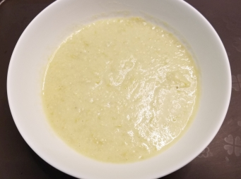

# 毛豆忌廉湯

## 📋 基本資訊 / Recipe Overview
- **料理名稱**：毛豆忌廉湯
- **份量 / Servings**：2-4 人份
- **素食流派 / Diet**：奶素 Lacto-Vegetarian
- **料理分類 / Category**：养生汤品
- **來源平台 / Source**：[香港佛教聯合會 · 素食食譜](https://www.hkbuddhist.org/zh/top_page.php?p=medical_menu_detail&cid=7&type_id=2&mmid=75&id=29)
- **刊物出處**：資料來源：《佛聯匯訊》
- **功德鳴謝**：鳴謝：溫綺玲居士

## 🌿 食材清單 / Ingredients
- 細馬鈴薯 1個
- 鮮檸檬葉絲 少許
- 鮮茴香 200克
- 毛豆仁 250
- 牛油 1湯匙
- 麵粉 2湯匙
- 水 4杯
- 鮮忌廉 杯

## 🧂 調味料 / Seasonings
- 鹽 適量
- 黑胡椒粉 少許

## 🍳 烹飪步驟 / Step-by-Step Cooking Steps
1. 馬鈴薯洗淨去皮切小件；毛豆仁洗淨瀝乾水；茴香切幼粒。
2. 倒少許橄欖油於鍋中，加入切碎的茴香，炒一會；再加入毛豆仁和馬鈴薯炒勻，加鹽和水煮腍。
3. 牛油與麵粉稍加拌炒，加少許鹽、黑胡椒粉，拌勻；加入（2）的材料再煮一會，然後用攪拌棒將湯料攪成滑稠（可以過濾一下，更幼滑；也可以不過濾，多些口感）。
4. 最後加入忌廉攪勻，盛湯碟；湯面放少許檸檬葉幼絲，可增添口味。

---
*食譜歸檔時間：2026-08-20 · 來源：香港佛教聯合會 (www.hkbuddhist.org)*