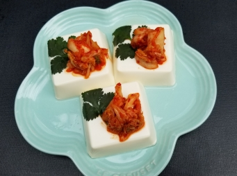

# 泡菜豆腐

## 📋 基本資訊 / Recipe Overview
- **料理名稱**：泡菜豆腐
- **份量 / Servings**：2-4 人份
- **素食流派 / Diet**：全素 Vegan (佛教純素)
- **料理分類 / Category**：面食主食
- **來源平台 / Source**：[香港佛教聯合會 · 素食食譜](https://www.hkbuddhist.org/zh/top_page.php?p=medical_menu_detail&cid=7&type_id=2&mmid=77&id=29)
- **刊物出處**：資料來源：《佛聯匯訊》
- **功德鳴謝**：鳴謝：溫綺玲居士

## 🌿 食材清單 / Ingredients
- 日本絹豆腐 3件
- 泡菜 適量
- 芫茜葉 少許

## 🧂 調味料 / Seasonings
- ，只有豆腐的豆香和泡菜本身獨特的味道。當然，如果要求純素者，就要選購素食泡菜。個人認為，就算不用芫茜葉
- 作裝飾，豆腐面鋪上泡菜已顯得足夠了。

## 🍳 烹飪步驟 / Step-by-Step Cooking Steps
1. 熱開水內放少許鹽，放入芫茜葉浸泡一會。
2. 把豆腐排在碟上；鑊內煮開水，把已放豆腐的碟放在蒸架上，隔水蒸約5分鐘。
3. 取出豆腐，趁熱放上浸過鹽水的芫茜葉，然後再加上泡菜。

---
*食譜歸檔時間：2026-08-20 · 來源：香港佛教聯合會 (www.hkbuddhist.org)*