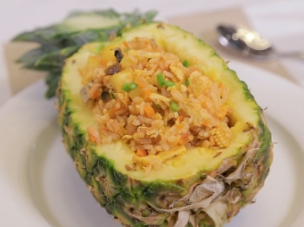

# 泰式菠蘿鮮蔬炒飯

## 📋 基本資訊 / Recipe Overview
- **料理名稱**：泰式菠蘿鮮蔬炒飯
- **份量 / Servings**：2人份
- **素食流派 / Diet**：蛋素 Ovo-Vegetarian
- **料理分類 / Category**：面食主食
- **來源平台 / Source**：[香港佛教聯合會 · 素食食譜](https://www.hkbuddhist.org/zh/top_page.php?p=medical_menu_detail&cid=7&type_id=2&mmid=72&id=29)
- **刊物出處**：資料來源：《香港佛教》月刊
- **功德鳴謝**：鳴謝：鄺梓罡 佛門網 素食餐廳「雅．悠蔬食」 素食超市「甘薯葉」

## 🌿 食材清單 / Ingredients
- 新鮮菠蘿（切粒）1/6個
- 泰國蘆筍（切粒）4條
- 甘筍（切粒）1/6條
- 粟米筍（切粒）4條
- 素火腿（切粒）適量
- 雜菌（切粒）半碗
- 南薑（切碎）1小塊
- 香茅（切碎）1條
- 檸檬葉（切碎）2片
- 雞蛋2隻（註：如家中有不黏鑊的平底鑊，可不下雞蛋）
- 冷飯2碗

## 🧂 調味料 / Seasonings
- 東炎醬1茶匙
- 番茄醬2湯匙
- 鹽半茶匙
- 糖1茶匙
- 香菇粉1茶匙

## 🍳 烹飪步驟 / Step-by-Step Cooking Steps
1. 熱鍋下油，先加入素火腿及雜菌，炒香後下甘筍、菠蘿、粟米筍、蘆筍炒熟，盛起備用。
2. 熱鍋下油，先下雞蛋炒至五成熟後加入冷飯炒開，當飯炒熱後將步驟1的材料回鍋炒匀。
3. 轉細火，加入所有調味料及南薑、香茅、檸檬葉後，再開大火拌炒均勻後即完成上碟。

---
*食譜歸檔時間：2026-08-20 · 來源：香港佛教聯合會 (www.hkbuddhist.org)*