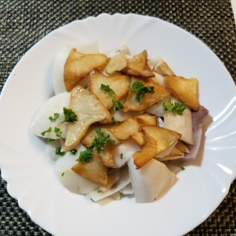

# 炒椰青靈菇片

## 📋 基本資訊 / Recipe Overview
- **料理名稱**：炒椰青靈菇片
- **份量 / Servings**：2-4 人份
- **素食流派 / Diet**：全素 Vegan (佛教純素)
- **料理分類 / Category**：养生汤品
- **來源平台 / Source**：[香港佛教聯合會 · 素食食譜](https://www.hkbuddhist.org/zh/top_page.php?p=medical_menu_detail&cid=7&type_id=2&mmid=103&id=29)
- **刊物出處**：資料來源：《佛聯匯訊》
- **功德鳴謝**：鳴謝：溫綺玲居士

## 🌿 食材清單 / Ingredients
- 椰青 1個
- 白靈菇 100克
- 芫茜碎 少許
- 薑 1片

## 🧂 調味料 / Seasonings
- 鹽 適量
- 薑汁 1茶匙
- 橄欖油 適量

## 🍳 烹飪步驟 / Step-by-Step Cooking Steps
1. 開椰青後，倒出椰青水；取出椰青肉，切件，備用；
2. 白靈菇切片，用薑汁、鹽醃一會；
3. 熱油鑊，放入白靈菇片，慢火煎至兩面金黃；
4. 熱油鑊，爆香薑片，加入椰青肉；灑少許椰青水，兜炒一會後撈起；鋪上菇片，再灑上芫茜碎。

---
*食譜歸檔時間：2026-08-20 · 來源：香港佛教聯合會 (www.hkbuddhist.org)*