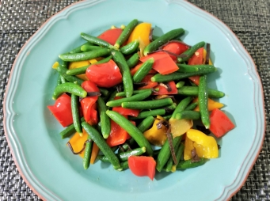

# 炒青瓜苗

## 📋 基本資訊 / Recipe Overview
- **料理名稱**：炒青瓜苗
- **份量 / Servings**：（1 人份）
- **素食流派 / Diet**：全素 Vegan (佛教純素)
- **料理分類 / Category**：佛門素齋 / 養生佳餚
- **來源平台 / Source**：[香港佛教聯合會 · 素食食譜](https://www.hkbuddhist.org/zh/top_page.php?p=medical_menu_detail&cid=7&type_id=2&mmid=78&id=29)
- **刊物出處**：資料來源：《佛聯匯訊》
- **功德鳴謝**：鳴謝：溫綺玲居士

## 🌿 食材清單 / Ingredients
- 紅甜椒 1個
- 黃甜椒 1個
- 青瓜苗 約150克
- 雲耳 數朵
- 薑 2片

## 🧂 調味料 / Seasonings
- 油 適量
- 鹽 適量
- 醬油 少許
- 黃砂糖 適量

## 🍳 烹飪步驟 / Step-by-Step Cooking Steps
1. 雲耳浸軟洗淨；放進鍋中滾水內，加鹽，滾至軟透；瀝乾，切絲。
2. 紅甜椒、黃甜椒去籽切件。
3. 青瓜苗洗淨去硬莖、去花（可按喜好保留）。
4. 熱油鑊，爆香薑片；放入全部材料，炒勻；加入調味料，灑少許水；兜勻後冚蓋約2至3分鐘至材料剛熟便成（可按喜好打茨）。

---
*食譜歸檔時間：2026-08-20 · 來源：香港佛教聯合會 (www.hkbuddhist.org)*