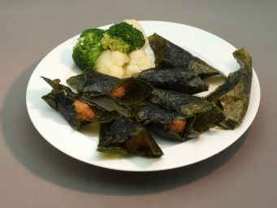

# 炸淮山紫菜

## 📋 基本資訊 / Recipe Overview
- **料理名稱**：炸淮山紫菜
- **份量 / Servings**：2-4 人份
- **素食流派 / Diet**：全素 Vegan (佛教純素)
- **料理分類 / Category**：佛門素齋 / 養生佳餚
- **來源平台 / Source**：[香港佛教聯合會 · 素食食譜](https://www.hkbuddhist.org/zh/top_page.php?p=medical_menu_detail&cid=7&type_id=2&mmid=57&id=29)
- **刊物出處**：資料來源：《香港佛教》月刊
- **功德鳴謝**：鳴謝：衍悌法師 凌雲寺

## 🔪 材料處理 / Preparation
1. 淮山洗淨後去皮，把淮山刨成淮山蓉（泥)。
2. 壽司紫菜分底面，較光身的是面，而粗身的是底。紫菜只須剪成小方塊。

## 🌿 食材清單 / Ingredients
- 淮山
- 紫菜（不含味壽司紫菜）

## 🧂 調味料 / Seasonings
- 鹽
- 生抽
- 七味粉
- 芥未（隨意）
- 昆布粉

## 🍳 烹飪步驟 / Step-by-Step Cooking Steps
1. 把所有調味料放入淮山蓉內拌勻。
2. 把淮山蓉置於紫菜的正中然後對摺（只須讓淮山蓉互相貼上便可。有時侯在外面吃到是圓卷形的，悉隨專便。)
3. 已包好的紫菜淮山可置於熱油中炸。淮山是可以生吃的，所以我們只須炸一會使其內軟外脆略帶金黄色便可起鑊。

## 💡 烹飪秘訣 / Chef's Tips
- 紫菜非常容易燒焦, 所以炸的時候要不停的翻及注意油温不可過熱。奶蛋素食者可加入雞蛋一個在淮山蓉內, 口感更脆鬆。

---
*食譜歸檔時間：2026-08-20 · 來源：香港佛教聯合會 (www.hkbuddhist.org)*