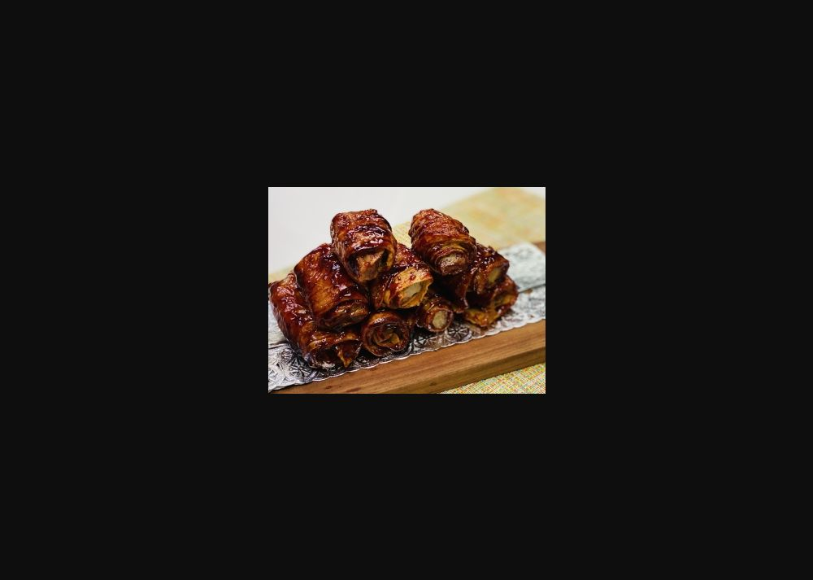

# 照燒素小排

## 📋 基本資訊 / Recipe Overview
- **料理名稱**：照燒素小排
- **份量 / Servings**：2-4 人份
- **素食流派 / Diet**：全素 Vegan (佛教純素)
- **料理分類 / Category**：面点小吃 / 經典小食
- **來源平台 / Source**：[香港佛教聯合會 · 素食食譜](https://www.hkbuddhist.org/zh/top_page.php?p=medical_menu_detail&cid=7&type_id=2&mmid=89&id=29)
- **刊物出處**：資料來源：《香港佛教》月刊
- **功德鳴謝**：鳴謝：朱丹鳳女士
- **食譜介紹**：農曆正月，親友來訪，可以煮一道簡單的小吃來和親友分享。「照燒素小排」用上多種調味料，醬香味濃郁，少許微酸，品嘗後讓人久久難忘。

## 🌿 食材清單 / Ingredients
- 腐皮 4張
- 蓮藕 1節

## 🧂 調味料 / Seasonings
- 生粉 適量
- 白糖 1湯匙
- 薑末 適量
- 甜麵醬 1湯匙
- 素調味粉 適量
- 老抽 適量
- 香醋 1茶匙

## 🍳 烹飪步驟 / Step-by-Step Cooking Steps
1. 將腐皮切半，鋪成長條；蓮藕去皮切成細條；把腐皮捲在蓮藕條上，再用牙籤固定，即成素排骨。下鍋前，把所有素排骨放在生粉裏沾一下。
2. 在鍋內下油，五成熱；素排骨放進鍋裏，小火炸至金黃色後撈出。
3. 在鍋裏留少許油，放入白糖，炒至融化；加入薑末、甜麵醬炒勻；再加入素調味粉、老抽、香醋、水炒成汁；放入炸好的素排骨翻炒，使醬汁均勻裹在素排骨上，上碟時拔除牙籤。

---
*食譜歸檔時間：2026-08-20 · 來源：香港佛教聯合會 (www.hkbuddhist.org)*
