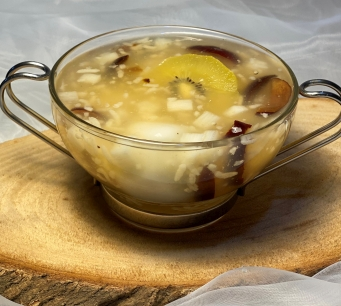

# 甜釀大棗山藥芝麻湯圓

## 📋 基本資訊 / Recipe Overview
- **料理名稱**：甜釀大棗山藥芝麻湯圓
- **份量 / Servings**：2人份
- **素食流派 / Diet**：全素 Vegan (佛教純素)
- **料理分類 / Category**：面食主食
- **來源平台 / Source**：[香港佛教聯合會 · 素食食譜](https://www.hkbuddhist.org/zh/top_page.php?p=medical_menu_detail&cid=7&type_id=2&mmid=111&id=29)
- **刊物出處**：資料來源：《香港佛教》月刊
- **功德鳴謝**：鳴謝：朱丹鳳女士

## 🌿 食材清單 / Ingredients
- 黑芝麻湯圓 1盒
- 淮山 50克
- 大棗 5顆
- 酒釀 10克
- 金奇異果 1個
- 蔗糖 30克
- 馬蹄粉 3克（按個人喜好）
- 水 500毫升

## 🍳 烹飪步驟 / Step-by-Step Cooking Steps
1. 淮山去皮，切細丁，放入半碗滾水中，攪開備用。
2. 大棗切細丁，金奇異果切片，備用。
3. 將500毫升水燒開，放入酒釀、淮山丁、大棗丁，以中火煮滾；再放入湯圓，以小火煮至湯圓漂浮在湯面（若喜歡湯有黏稠感，可用適量的水混合馬蹄粉，然後加入湯內）；最後放入金奇異果片、蔗糖，此甜品熱食或常溫吃均可。

---
*食譜歸檔時間：2026-08-20 · 來源：香港佛教聯合會 (www.hkbuddhist.org)*