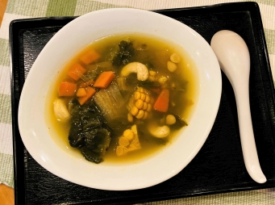

# 白菜菜乾蔬食老火湯

## 📋 基本資訊 / Recipe Overview
- **料理名稱**：白菜菜乾蔬食老火湯
- **份量 / Servings**：2 人份
- **素食流派 / Diet**：全素 Vegan (佛教純素)
- **料理分類 / Category**：养生汤品
- **來源平台 / Source**：[香港佛教聯合會 · 素食食譜](https://www.hkbuddhist.org/zh/top_page.php?p=medical_menu_detail&cid=7&type_id=2&mmid=76&id=29)
- **刊物出處**：資料來源：《香港佛教》月刊
- **功德鳴謝**：鳴謝：朱丹鳳女士

## 🌿 食材清單 / Ingredients
- 菜乾 100克
- 白菜 600克
- 紅蘿蔔 2根
- 粟米 2根
- 腰果 50克
- 南北杏 30克
- 椰棗 4顆
- 枸杞 10克

## 🧂 調味料 / Seasonings
- 油 適量
- 鹽 適量

## 🍳 烹飪步驟 / Step-by-Step Cooking Steps
1. 菜乾清洗乾淨後，加水浸過菜乾面，浸泡2小時，瀝水備用。
2. 白菜洗淨，撕葉備用。
3. 將紅蘿蔔、粟米洗淨切塊，腰果、南北杏、椰棗、枸杞洗淨備用。
4. 下少許油於鑊，將所有材料略炒。
5. 注入約2公升水於鍋中，放入全部材料武火煲至水滾，再改為文火煲50分鐘左右，最後加入少許鹽調味即可。（白菜可在煮湯的後半小時才加入，以增加口感。）

---
*食譜歸檔時間：2026-08-20 · 來源：香港佛教聯合會 (www.hkbuddhist.org)*