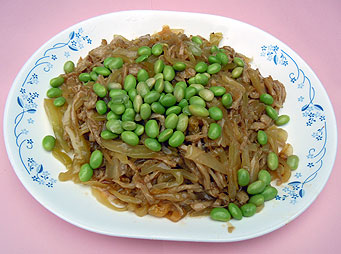

# 福慧綿長

## 📋 基本資訊 / Recipe Overview
- **料理名稱**：福慧綿長
- **份量 / Servings**：2-4 人份
- **素食流派 / Diet**：全素 Vegan (佛教純素)
- **料理分類 / Category**：佛門素齋 / 養生佳餚
- **來源平台 / Source**：[香港佛教聯合會 · 素食食譜](https://www.hkbuddhist.org/zh/top_page.php?p=medical_menu_detail&cid=7&type_id=2&mmid=40&id=29)
- **刊物出處**：資料來源：《香港佛教》月刊

## 🌿 食材清單 / Ingredients
- 麵筋（適量，依步驟所需）
- 鹹酸菜（適量，依步驟所需）
- 毛豆（適量，依步驟所需）
- 薑絲（適量，依步驟所需）
- 芝麻（適量，依步驟所需）
- 麻油（適量，依步驟所需）

## 🍳 烹飪步驟 / Step-by-Step Cooking Steps
1. 麵筋用手撕成小條狀，然後氽水，氽水後用吸油紙吸乾麵筋絲水份。麵筋絲吸乾水份後，用少許油以中火略炒，使麵筋絲乾身；
2. 鹹酸菜用清水浸泡清洗後，切成幼絲備用。（鹹酸菜浸泡時間，看個人對鹹、酸味道接受的程度而定）；
3. 毛豆氽水備用；
4. 放油少許燒熱，用薑絲起鍋，先放鹹酸菜絲，炒至軟身後，再放麵筋絲快炒，然後再放適量豉油、鹽、糖、開水一同炒至麵筋絲入味後即成；
5. 起鍋後，再放毛豆，少許芝麻及麻油增加香味。

---
*食譜歸檔時間：2026-08-20 · 來源：香港佛教聯合會 (www.hkbuddhist.org)*