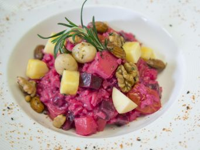

# 紅菜頭鮮果忌廉意大利飯

## 📋 基本資訊 / Recipe Overview
- **料理名稱**：紅菜頭鮮果忌廉意大利飯
- **份量 / Servings**：2人份
- **素食流派 / Diet**：奶素 Lacto-Vegetarian
- **料理分類 / Category**：面食主食
- **來源平台 / Source**：[香港佛教聯合會 · 素食食譜](https://www.hkbuddhist.org/zh/top_page.php?p=medical_menu_detail&cid=7&type_id=2&mmid=58&id=29)
- **刊物出處**：資料來源：《香港佛教》月刊
- **功德鳴謝**：鳴謝：鄺梓罡 佛門網 素食餐廳「雅．悠蔬食」

## 🌿 食材清單 / Ingredients
- 夏威夷果仁 50克
- 腰果 50克
- 杏仁 50克
- 核桃 50克
- 松子仁 50克
- 迷迭香 2束

## 🧂 調味料 / Seasonings
- 七味粉 半湯匙
- 海鹽 半茶匙
- 糖 半茶匙
- 橄欖油 1.5湯匙
- 鹽 1茶匙
- 糖 半茶匙
- 香菇粉 1.5茶匙
- 黑胡椒碎 適量
- 芝士粉 2湯匙
- （純素者可不落芝士粉）

## 🍳 烹飪步驟 / Step-by-Step Cooking Steps
1. 將所有果仁分別用180度焗爐焗熟，備用。
2. 迷迭香取出葉子，切碎備用。
3. 燒熱鍋，下橄欖油，先下迷迭香炒出香味，然後加入所有果仁及餘下調味料，拌匀即成。
4. 每種果仁焗熟的時間不同，所以要分開焗。可買現成焗好的雜果仁，節省時間。
5. 製作好的果仁用密封盒盛好，放在陰涼地方可以存約1個月。
6. 紅菜頭鮮果忌廉意大利飯材料：
7. 紅菜頭 1細個、富士蘋果（切粒）1個、火龍果（切粒）1個
8. 車厘茄 （切半）10粒、菠蘿 （切粒）1/6個、淡忌廉 100克
9. 意大利米 150克、香草雜果仁（適量）
10. （純素者可以杏仁奶或豆漿代替淡忌廉）
11. 先將意大利米用1比1的水蒸約40分鐘至熟，備用。
12. 將紅菜頭去皮切粒，隔水蒸約20分鐘，放涼，備用。
13. 開大火，熱鍋下油，先加入紅菜頭及蘋果，炒香後加入適量的熱水，下鹽、糖及香菇粉調味。
14. 水滾後加入適量的意大利飯及忌廉，以中火煮至剩下少許湯汁時，加入餘下的蔬果略煮一會，加入芝士粉，不停搞拌將湯汁與飯混合，然後加入黑胡椒碎調味。
15. 最後在飯面上澆上雜果仁，完成。

---
*食譜歸檔時間：2026-08-20 · 來源：香港佛教聯合會 (www.hkbuddhist.org)*