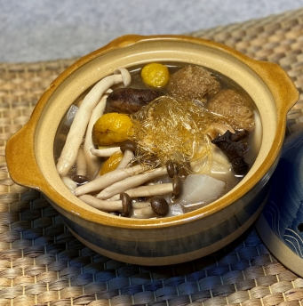

# 純素佛跳牆

## 📋 基本資訊 / Recipe Overview
- **料理名稱**：純素佛跳牆
- **份量 / Servings**：4人份
- **素食流派 / Diet**：全素 Vegan (佛教純素)
- **料理分類 / Category**：面食主食
- **來源平台 / Source**：[香港佛教聯合會 · 素食食譜](https://www.hkbuddhist.org/zh/top_page.php?p=medical_menu_detail&cid=7&type_id=2&mmid=104&id=29)
- **刊物出處**：資料來源：《香港佛教》月刊
- **功德鳴謝**：鳴謝：朱丹鳳女士

## 🌿 食材清單 / Ingredients
- 乾花菇 50克
- 海鮮菇 1包
- 日本大根 300克
- 蟹味菇 1包
- 板栗 1包
- 無花果 2顆
- 素翅 50克
- 雲耳 30克
- 腰果 30克

## 🧂 調味料 / Seasonings
- 猴頭菇 1包（約250克）
- 鹽 1茶匙
- 白胡椒粉 1茶匙
- 蔭油 1湯匙
- 芝麻油 1湯匙

## 🍳 烹飪步驟 / Step-by-Step Cooking Steps
1. 洗淨乾花菇，放入溫水泡半小時（水剛過菇面），備用。
2. 將海鮮菇、蟹味菇切去根部，洗淨備用。
3. 日本大根洗淨切塊，餘下材料洗淨備用。
4. 下少許油熱鑊，將大根略炒撈起；再下少許油炒香其他材料。
5. 煲中注入約2公升水，放入炒香的材料；武火煲至水滾後，改為文火煨約20分鐘，最後加入調味即可。

---
*食譜歸檔時間：2026-08-20 · 來源：香港佛教聯合會 (www.hkbuddhist.org)*