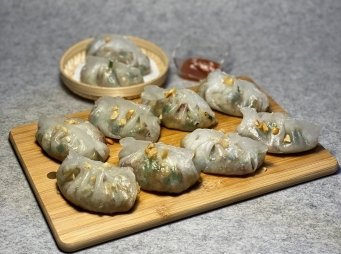

# 純素潮州粉果

## 📋 基本資訊 / Recipe Overview
- **料理名稱**：純素潮州粉果
- **份量 / Servings**：4人份
- **素食流派 / Diet**：全素 Vegan (佛教純素)
- **料理分類 / Category**：面点小吃
- **來源平台 / Source**：[香港佛教聯合會 · 素食食譜](https://www.hkbuddhist.org/zh/top_page.php?p=medical_menu_detail&cid=7&type_id=2&mmid=107&id=29)
- **刊物出處**：資料來源：《香港佛教》月刊
- **功德鳴謝**：鳴謝：朱丹鳳女士

## 🌿 食材清單 / Ingredients
- 澄粉 150克
- 生粉 150克
- 香菇 50克
- 芹菜 1棵
- 沙葛 半個
- 三色雜豆 50克
- 花生 50克
- 薑末 1小匙
- 菜甫乾 20克
- 芫茜 1 棵

## 🧂 調味料 / Seasonings
- 鹽 1茶匙
- 芥花籽油 50毫升
- 椰糖 1茶匙
- 素菇粉 1茶匙
- 醬油 1湯匙
- 五香粉 適量
- 胡椒粉 適量
- 香菇素蠔油 1湯匙
- 麻油 適量

## 🍳 烹飪步驟 / Step-by-Step Cooking Steps
1. 浸泡香菇，切粒，備用。
2. 將所有蔬菜洗淨，瀝乾水，切粒，備用。
3. 熱鑊，微火將花生炒熟，放涼備用。
4. 熱鑊，倒少許芥花籽油，放入薑末炒香，加入香菇粒，小火炒至微黃，撈起備用。
5. 熱鑊，倒芥花籽油，放入菜甫乾炒香；加入三色雜豆、炒好的香菇粒；放入椰糖、鹽、素菇粉、醬油、五香粉、胡椒粉、香菇素蠔油，慢火炒2分鐘；再放入沙葛粒，加3湯匙生粉水勾勻，蓋鍋燜1分鐘；熄火後放入芹菜、芫茜拌勻；最後倒入麻油放涼，包餡前放入花生即可。
6. 將包好的粉果放進蒸籠並列排好，水滾後把蒸籠放入鍋，蒸約8分鐘即可出鍋。

---
*食譜歸檔時間：2026-08-20 · 來源：香港佛教聯合會 (www.hkbuddhist.org)*