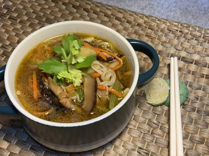

# 純素麻油雜蔬麵線

## 📋 基本資訊 / Recipe Overview
- **料理名稱**：純素麻油雜蔬麵線
- **份量 / Servings**：2人份
- **素食流派 / Diet**：全素 Vegan (佛教純素)
- **料理分類 / Category**：面食主食
- **來源平台 / Source**：[香港佛教聯合會 · 素食食譜](https://www.hkbuddhist.org/zh/top_page.php?p=medical_menu_detail&cid=7&type_id=2&mmid=97&id=29)
- **刊物出處**：資料來源：《香港佛教》月刊
- **功德鳴謝**：鳴謝：朱丹鳳女士

## 🌿 食材清單 / Ingredients
- 麵線 1包
- 香菇 20克
- 黑木耳 20克
- 乾金針菜 20克
- 紅蘿蔔 1根
- 芹菜（中） 3根
- 濕枝竹 2條
- 薑末 1茶匙
- 榨菜絲 1小包
- 香芹 少量
- 調料：
- 素高湯 1粒
- 糖 1茶匙
- 鹽 1茶匙
- 素菇粉 1茶匙
- 醬油 1湯匙
- 粟粉 適量
- 麻油 適量
- 烏醋 1湯匙
- 芥花籽油 1湯匙
- 白胡椒粉 適量

## 🍳 烹飪步驟 / Step-by-Step Cooking Steps
1. 泡發香菇、黑木耳、乾金針菜，切絲備用。
2. 洗淨紅蘿蔔、芹菜，切絲備用。
3. 熱鍋，倒入芥花籽油，下薑末炒香，放入濕枝竹、榨菜絲及所有切成絲的材料，炒勻，備用。
4. 燒水，放麵線煮至沸騰，撈起備用。
5. 燒1公升水，下高湯粒煮成湯；放入麵線及炒好的材料；邊煮邊放糖、鹽、素菇粉、醬油，拌勻煮開；倒入粟粉水勾薄芡，最後淋上麻油、烏醋。
6. 起鍋，撒上白胡椒粉，以香芹點綴。
7. 註：自製高湯材料：高麗菜、昆布、芹菜、香菇、紅蘿蔔、蘋果、蜜棗。

---
*食譜歸檔時間：2026-08-20 · 來源：香港佛教聯合會 (www.hkbuddhist.org)*