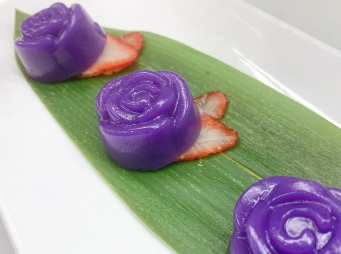

# 紫薯椰汁玫瑰

## 📋 基本資訊 / Recipe Overview
- **料理名稱**：紫薯椰汁玫瑰
- **份量 / Servings**：2人份
- **素食流派 / Diet**：全素 Vegan (佛教純素)
- **料理分類 / Category**：面食主食
- **來源平台 / Source**：[香港佛教聯合會 · 素食食譜](https://www.hkbuddhist.org/zh/top_page.php?p=medical_menu_detail&cid=7&type_id=2&mmid=85&id=29)
- **刊物出處**：資料來源：《香港佛教》月刊
- **功德鳴謝**：鳴謝：鄺梓罡

## 🌿 食材清單 / Ingredients
- 木薯粉 250克
- 粘米粉 45克
- 紫薯粉 25克
- 鹽 1克
- 椰汁 300克
- 碎冰糖 135克
- 水 300克

## 🍳 烹飪步驟 / Step-by-Step Cooking Steps
1. 用300克水煮溶碎冰糖，略放涼備用。
2. 將木薯粉、粘米粉、紫薯粉及鹽倒入綱盆中拌匀。
3. 加入椰汁於綱盆內，略拌勻；再加入冰糖水，充分攪拌；之後用隔篩過濾，隔去粉粒，成糕漿。
4. 在玫瑰矽膠模內掃油，將糕漿倒入至9分滿；中大火蒸約15分鐘，放涼後脫模，即可享用。全部材料約可做出40朵玫瑰。

---
*食譜歸檔時間：2026-08-20 · 來源：香港佛教聯合會 (www.hkbuddhist.org)*