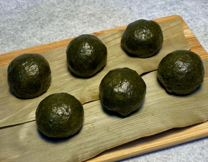

# 艾草青糰

## 📋 基本資訊 / Recipe Overview
- **料理名稱**：艾草青糰
- **份量 / Servings**：4人份
- **素食流派 / Diet**：全素 Vegan (佛教純素)
- **料理分類 / Category**：面食主食
- **來源平台 / Source**：[香港佛教聯合會 · 素食食譜](https://www.hkbuddhist.org/zh/top_page.php?p=medical_menu_detail&cid=7&type_id=2&mmid=108&id=29)
- **刊物出處**：資料來源：《香港佛教》月刊
- **功德鳴謝**：鳴謝：朱丹鳳女士

## 🌿 食材清單 / Ingredients
- 鮮艾草 300克
- 糯米粉 600克
- 澄粉 50克
- 蔗糖 200克
- 眉豆 400克

## 🧂 調味料 / Seasonings
- 鹽 3茶匙
- 芥花籽油 50克
- 芝麻薑油 100克（可用芝麻油和薑蓉炸製）
- 菇粉 1茶匙
- 五香粉 1茶匙

## 🍳 烹飪步驟 / Step-by-Step Cooking Steps
1. 艾草皮
2. a. 洗淨鮮艾草，去枝梗，留嫩葉；
3. b. 將艾葉放進燒開水的鍋中，下1茶匙鹽，焯水約2分鐘；撈起，放入冷水盆中過冷水；瀝水，放入攪拌機打成泥，然後放入和好的糯米粉、澄粉中攪拌，用手搓勻；加入蔗糖、芥花籽油，用力拌揉20分鐘，至粉糰呈光滑狀；
4. c. 將揉好的粉糰平鋪在平底碟中，再放入燒開水的蒸鍋內，中火蒸約40分鐘至熟透；取出放涼備用。
5. 眉豆餡
6. a. 洗淨眉豆，用滾水浸泡2小時；瀝水，放入砂鍋，以中火燜煮至熟透；撈起，瀝水，趁熱搗成豆泥備用；
7. b. 倒芝麻薑油於平底鍋，小火熱鍋；放入眉豆蓉，慢慢炒香，邊炒邊加入2茶匙鹽、菇粉、五香粉翻炒至乾身，倒出放涼；用手捏成小球狀，備用。
8. 將粉糰分成約30等份，每份皮用手搓圓並壓平，包入眉豆球，再包實成圓形狀即可。

---
*食譜歸檔時間：2026-08-20 · 來源：香港佛教聯合會 (www.hkbuddhist.org)*