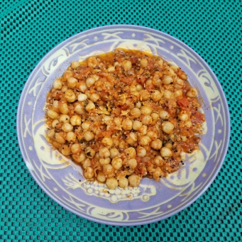

# 茄醬藜麥鷹咀豆

## 📋 基本資訊 / Recipe Overview
- **料理名稱**：茄醬藜麥鷹咀豆
- **份量 / Servings**：2-4 人份
- **素食流派 / Diet**：全素 Vegan (佛教純素)
- **料理分類 / Category**：面食主食
- **來源平台 / Source**：[香港佛教聯合會 · 素食食譜](https://www.hkbuddhist.org/zh/top_page.php?p=medical_menu_detail&cid=7&type_id=2&mmid=99&id=29)
- **刊物出處**：資料來源：《佛聯匯訊》
- **功德鳴謝**：鳴謝：溫綺玲居士

## 🌿 食材清單 / Ingredients
- 鷹咀豆 150克
- 番茄 300克
- 甘筍 20克
- 鮮茴香 20克
- 藜麥 2湯匙
- 水 1000毫升

## 🧂 調味料 / Seasonings
- 油 適量
- 鹽 少許
- 黑胡椒 少許
- 煙紅椒粉 1湯匙
- 糖 2湯匙

## 🍳 烹飪步驟 / Step-by-Step Cooking Steps
1. 鷹咀豆洗淨，浸泡一夜後，浸豆的水留用。
2. 燒開水，放鹽巴，中火煲豆約1小時至腍。
3. 番茄去皮、去核，切小粒；甘筍去皮，切小粒；鮮茴香切粒。
4. 熱鑊，下藜麥，略炒至出香味；加油，放入鮮茴香、甘筍、番茄粒，炒一會；加入其他調味料，炒勻；加浸豆的水，冚蓋，中慢火煮約20分鐘，焗約5分鐘盛碟。

---
*食譜歸檔時間：2026-08-20 · 來源：香港佛教聯合會 (www.hkbuddhist.org)*