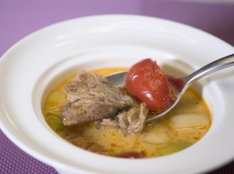

# 蔬果素瘦肉冬蔭湯

## 📋 基本資訊 / Recipe Overview
- **料理名稱**：蔬果素瘦肉冬蔭湯
- **份量 / Servings**：2人份
- **素食流派 / Diet**：全素 Vegan (佛教純素)
- **料理分類 / Category**：养生汤品
- **來源平台 / Source**：[香港佛教聯合會 · 素食食譜](https://www.hkbuddhist.org/zh/top_page.php?p=medical_menu_detail&cid=7&type_id=2&mmid=73&id=29)
- **刊物出處**：資料來源：《香港佛教》月刊
- **功德鳴謝**：鳴謝：鄺梓罡 佛門網 素食餐廳「雅．悠蔬食」 素食超市「甘薯葉」

## 🌿 食材清單 / Ingredients
- 素瘦肉10塊
- 草菇（切厚片）8粒
- 菠蘿（切粒）1/4個
- 無核紅提子1小束
- 青蘋果（切粒）1個
- 車厘茄（切半）100克
- 南薑（切絲）1塊
- 香茅（切絲）4條
- 檸檬葉（切絲）5片

## 🧂 調味料 / Seasonings
- 東炎醬1.5湯匙
- 香菇粉1.5茶匙
- 青檸1個
- 椰汁適量
- 鹽1茶匙
- 糖1湯匙

## 🍳 烹飪步驟 / Step-by-Step Cooking Steps
1. 南薑、香茅和檸檬片放入香料包，備用。
2. 加入約1,200毫升熱水及放入香料包，煮沸後轉中小火煮約10分鐘，期間用湯殼撇走浮面雜質。
3. 煮10分鐘後，取走香料包，再將餘下材料（除青檸汁及椰汁）放進湯中，加入其他調味料略煮一會。
4. 最後加入青檸汁及椰汁拌勻，完成。可按個人口味加入少許辣椒油，提升辣度。

---
*食譜歸檔時間：2026-08-20 · 來源：香港佛教聯合會 (www.hkbuddhist.org)*