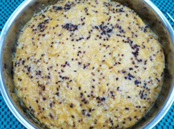

# 藜麥小米南瓜糕

## 📋 基本資訊 / Recipe Overview
- **料理名稱**：藜麥小米南瓜糕
- **份量 / Servings**：2-4 人份
- **素食流派 / Diet**：奶素 Lacto-Vegetarian
- **料理分類 / Category**：面食主食
- **來源平台 / Source**：[香港佛教聯合會 · 素食食譜](https://www.hkbuddhist.org/zh/top_page.php?p=medical_menu_detail&cid=7&type_id=2&mmid=94&id=29)
- **刊物出處**：資料來源：《佛聯匯訊》
- **功德鳴謝**：鳴謝：溫綺玲居士

## 🌿 食材清單 / Ingredients
- 藜麥 50克
- 小米 50克
- 南瓜 300克
- 牛奶 300毫升
- 酵母粉 6克
- 糖 30克
- 麵粉 300克

## 🍳 烹飪步驟 / Step-by-Step Cooking Steps
1. 洗淨小米後，浸泡約3至4小時，瀝乾。
2. 南瓜削皮、去籽、切件，然後放於蒸盆內；鋪上小米和沖洗好的藜麥。水滾後，大火蒸約15至20分鐘至藜麥、小米熟透；全放進攪拌機內，加入牛奶，打成南瓜糊。
3. 南瓜糊倒在大糕盆內，待涼後加入酵母粉、糖；攪勻至酵母粉溶解，再加入麵粉，繼續攪拌至沒有麵粉粒；冚上蓋發酵至2倍大，倒出搓一會，排出麵團內的氣泡，置一旁備用。
4. 在糕盆內塗上油，倒入粉團，冚蓋，再發酵10分鐘；大火蒸25分鐘，熄火；靜候5分鐘後才取出南瓜糕。

---
*食譜歸檔時間：2026-08-20 · 來源：香港佛教聯合會 (www.hkbuddhist.org)*