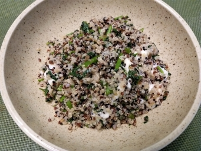

# 藜麥芝士飯

## 📋 基本資訊 / Recipe Overview
- **料理名稱**：藜麥芝士飯
- **份量 / Servings**：2-4 人份
- **素食流派 / Diet**：奶素 Lacto-Vegetarian
- **料理分類 / Category**：米食主食
- **來源平台 / Source**：[香港佛教聯合會 · 素食食譜](https://www.hkbuddhist.org/zh/top_page.php?p=medical_menu_detail&cid=7&type_id=2&mmid=65&id=29)
- **刊物出處**：資料來源：《佛聯匯訊》
- **功德鳴謝**：鳴謝：溫綺玲居士

## 🌿 食材清單 / Ingredients
- 藜麥1杯
- 菲達芝士（Feta）粗粒2件
- 西洋菜約200g

## 🧂 調味料 / Seasonings
- 橄欖油適量
- 鹽適量
- 黑胡椒適量

## 🍳 烹飪步驟 / Step-by-Step Cooking Steps
1. 熱油鑊，加入藜麥，炒至卜卜聲；再加入2杯水，加蓋煮15分鐘之後，熄火；焗5分鐘，便成飯。
2. 煮滾一鍋水，加鹽後，放入西洋菜，稍微一灼，撈起，揸水，切粒。
3. 熱油鑊，加入西洋菜粒、黑胡椒、少許鹽，炒勻；再加入芝士粒，炒勻後，加入藜麥飯內，撈勻。

---
*食譜歸檔時間：2026-08-20 · 來源：香港佛教聯合會 (www.hkbuddhist.org)*