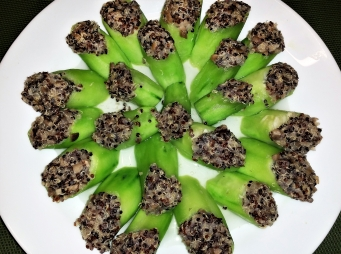

# 藜麥釀絲瓜

## 📋 基本資訊 / Recipe Overview
- **料理名稱**：藜麥釀絲瓜
- **份量 / Servings**：（2 人份）
- **素食流派 / Diet**：全素 Vegan (佛教純素)
- **料理分類 / Category**：养生汤品
- **來源平台 / Source**：[香港佛教聯合會 · 素食食譜](https://www.hkbuddhist.org/zh/top_page.php?p=medical_menu_detail&cid=7&type_id=2&mmid=95&id=29)
- **刊物出處**：資料來源：《佛聯匯訊》
- **功德鳴謝**：鳴謝：溫綺玲居士

## 🌿 食材清單 / Ingredients
- 藜麥 100克
- 絲瓜 1條

## 🧂 調味料 / Seasonings
- 芝麻香椿醬 約2-3湯匙
- 鹽 少許

## 🍳 烹飪步驟 / Step-by-Step Cooking Steps
1. 絲瓜洗淨削皮，切長件，挖去少許瓜囊，備用。
2. 熱油鑊，加入藜麥，炒一會；再加入2杯水，加蓋煮15分鐘後，熄火；加芝麻香椿醬、鹽，焗5分鐘。
3. 最後把煮成飯的藜麥釀入絲瓜，蒸約10分鐘。

---
*食譜歸檔時間：2026-08-20 · 來源：香港佛教聯合會 (www.hkbuddhist.org)*