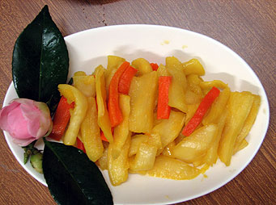

# 蜜餞蘿蔔

## 📋 基本資訊 / Recipe Overview
- **料理名稱**：蜜餞蘿蔔
- **份量 / Servings**：2-4 人份
- **素食流派 / Diet**：全素 Vegan (佛教純素)
- **料理分類 / Category**：佛門素齋 / 養生佳餚
- **來源平台 / Source**：[香港佛教聯合會 · 素食食譜](https://www.hkbuddhist.org/zh/top_page.php?p=medical_menu_detail&cid=7&type_id=2&mmid=2&id=29)
- **刊物出處**：資料來源：《香港佛教》月刊
- **功德鳴謝**：資料提供：觀宗寺果德法師監院

## 🌿 食材清單 / Ingredients
- 蘿蔔

## 🍳 烹飪步驟 / Step-by-Step Cooking Steps
1. 將蘿蔔洗淨，連皮切半吋厚，呈長條狀；
2. 用鹽把蘿蔔搓軟；
3. 放入筲箕內，用重物壓著，待蘿蔔的澀水排出；並加保鮮紙蓋面，以免被污物弄髒，至隔晚；
4. 將蜜糖煑熱，放涼；
5. 然後把蘿蔔放入蜜糖內，加黃薑粉，攪勻；待入味後才可食用。

---
*食譜歸檔時間：2026-08-20 · 來源：香港佛教聯合會 (www.hkbuddhist.org)*