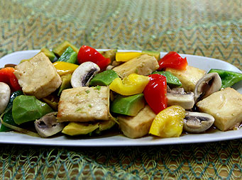

# 醍醐酥酪

## 📋 基本資訊 / Recipe Overview
- **料理名稱**：醍醐酥酪
- **份量 / Servings**：2-4 人份
- **素食流派 / Diet**：奶素 Lacto-Vegetarian
- **料理分類 / Category**：面点小吃
- **來源平台 / Source**：[香港佛教聯合會 · 素食食譜](https://www.hkbuddhist.org/zh/top_page.php?p=medical_menu_detail&cid=7&type_id=2&mmid=33&id=29)
- **刊物出處**：資料來源：《香港佛教》月刊

## 🌿 食材清單 / Ingredients
- 鮮奶豆腐
- 牛油果
- 彩椒
- 蘑菇
- 紅蘿蔔

## 🍳 烹飪步驟 / Step-by-Step Cooking Steps
1. 鮮奶及豆腐切塊，牛油果去皮去核切塊，彩椒、蘑菇、紅蘿蔔切塊；
2. 鮮奶豆腐過油後炆；
3. 最後放牛油果、彩椒、蘑菇、紅蘿蔔炆煮至熟即可。

---
*食譜歸檔時間：2026-08-20 · 來源：香港佛教聯合會 (www.hkbuddhist.org)*